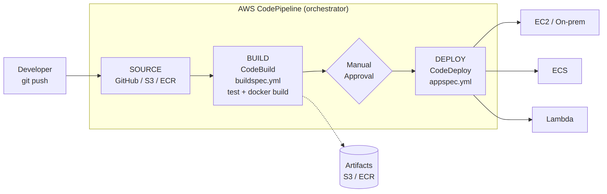

# 📚 Day 65 — AWS CodePipeline: Stage, Action ও Artifact

> 📊 **Visual Summary** — সহজে বোঝার জন্য diagram:



**সময়:** ২ ঘণ্টা | **Module:** ১১ (CI/CD: CodePipeline & CodeBuild) — Day 2

## 🎯 আজকের লক্ষ্য
- AWS CodePipeline কী, কেন এটা "orchestrator" (CodeBuild/CodeDeploy না)
- **Stage** ও **Action**: Source, Build, Test, Approval, Deploy
- Source provider: CodeCommit, S3, ECR, বা **CodeStar Connections** দিয়ে GitHub/GitLab/Bitbucket
- Stage-এর মধ্যে **artifact** কীভাবে পাস হয় (S3-ভিত্তিক)
- Pipeline trigger: push-এ automatic, নাকি manual
- CodePipeline বনাম GitHub Actions (Day 21-এর সাথে তুলনা)

---

## Part 1: CodePipeline — পুরো CI/CD-র "Orchestrator"

Day 64-এ CodeBuild শিখেছেন (শুধু **build** করে), Day 21-এ CodeDeploy শিখেছেন (শুধু **deploy** করে)। কিন্তু "কোড push হলে automatically build → test → deploy" — এই পুরো প্রবাহ **কে সাজায়**?

**AWS CodePipeline** — এই পুরো CI/CD workflow-কে **stage-এ ভাগ করে চালায়**, প্রতিটা stage-এর ফলাফলের উপর ভিত্তি করে পরের stage শুরু করে।

```
Source ──► Build ──► (Approval) ──► Deploy
  │           │                       │
CodeCommit  CodeBuild             CodeDeploy/ECS/
/GitHub                           CloudFormation/Lambda
```

> **মনে রাখার কৌশল:** CodePipeline **orchestrator** (কে কখন চলবে ঠিক করে); CodeBuild/CodeDeploy **executor** (আসল কাজ করে)।

---

## Part 2: Stage ও Action

- **Stage**: পাইপলাইনের একটা ধাপ (Source, Build, Deploy)
- **Action**: একটা stage-এর ভেতরের আসল কাজ (যেমন Build stage-এ "CodeBuild" action)
- একটা stage-এ একাধিক action **parallel** বা **sequential** চলতে পারে (যেমন একই সাথে unit test আর lint action)

| Action Category | উদাহরণ |
|---|---|
| Source | CodeCommit, S3, ECR, GitHub (via CodeStar Connections) |
| Build/Test | CodeBuild, Jenkins (third-party integration) |
| Approval | Manual approval (SNS notification-সহ) |
| Deploy | CodeDeploy, ECS, CloudFormation, S3, Lambda |

---

## Part 3: Source Provider — CodeStar Connections দিয়ে GitHub

আগে GitHub-এর জন্য personal access token ব্যবহার হতো (নিরাপত্তা ঝুঁকি)। এখন **CodeStar Connections** দিয়ে GitHub App-ভিত্তিক, token ছাড়া secure সংযোগ করা যায় — অনেকটা Day 21-এর GitHub Actions OIDC-এর মতোই দর্শন (দীর্ঘস্থায়ী secret এড়ানো)।

```
GitHub repo (push event) ──► CodeStar Connection ──► CodePipeline Source stage triggers
```

---

## Part 4: Artifact — Stage-এর মধ্যে ডেটা পাস করা

প্রতিটা stage-এর output ("artifact") পরের stage-এর input হিসেবে যায়, সবকিছু **S3 bucket**-এ (পাইপলাইনের নিজস্ব artifact store) সংরক্ষিত হয়।

```
Source stage output artifact (SourceArtifact) ──► Build stage input
Build stage output artifact (BuildArtifact, যেমন imagedefinitions.json) ──► Deploy stage input
```

CodeBuild-এর `artifacts` সেকশন (Day 64) ঠিক এই output artifact তৈরি করে।

---

## Part 5: Manual Approval Action

Production deploy-এর আগে একজন মানুষের অনুমোদন চাইতে **Approval** action যোগ করা যায় — SNS-এর মাধ্যমে notification যায় (Day 30-এর SNS-এর practical ব্যবহার), অনুমোদন না দেওয়া পর্যন্ত পাইপলাইন থেমে থাকে।

```
Build stage ──► Manual Approval (SNS → Slack/email) ──► Deploy to Production stage
```

---

## Part 6: Trigger — কখন Pipeline চলে?

- **Automatic**: Source repo-তে push/merge হলেই CloudWatch Events/EventBridge rule দিয়ে pipeline trigger হয় (default আচরণ)
- **Manual**: console/CLI থেকে "Release change" চেপে

### CodePipeline বনাম GitHub Actions (Day 21)
| | **CodePipeline** | **GitHub Actions** |
|---|---|---|
| চলে কোথায় | AWS-এর ভেতরে, IAM-নেটিভ | GitHub-এর runner-এ, OIDC দিয়ে AWS-এ যায় |
| AWS service integration | গভীর (CodeBuild/CodeDeploy/ECS নেটিভ) | API কল করে করতে হয় |
| Source of truth | AWS console/CLI/CloudFormation | `.github/workflows/*.yml`, কোডের সাথেই থাকে |
| উপযুক্ত | AWS-only ভারী পাইপলাইন, console-এ visual pipeline দরকার | GitHub-কেন্দ্রিক টিম, multi-cloud/general-purpose CI |

**একসাথেও ব্যবহার হয়:** GitHub Actions দিয়ে test/lint, তারপর CodePipeline দিয়ে AWS-নেটিভ deploy অংশ — দুটোর শক্তি মিলিয়ে।

---

## Part 7: Hands-on Lab

1. একটা CodePipeline তৈরি করুন: Source (GitHub, CodeStar Connection দিয়ে) → Build (Day 64-এর CodeBuild project) → Deploy (S3 বা CodeDeploy)
2. GitHub-এ একটা commit push করে automatic trigger দেখুন
3. একটা Manual Approval stage যোগ করুন, SNS topic-এর সাথে সংযুক্ত করুন
4. Approval না দিয়ে pipeline "In Progress" অবস্থায় আটকে থাকা দেখুন, তারপর approve করে পরের stage চলতে দিন
5. Pipeline-এর "Release change" বাটন দিয়ে manually আবার চালান
6. Pipeline মুছুন

---

## 🎯 আজকের মূল Takeaways
- CodePipeline orchestrator; CodeBuild/CodeDeploy/ECS deploy action — আসল কাজ করে
- Stage-এর মধ্যে artifact S3-এর মাধ্যমে পাস হয়
- CodeStar Connections দিয়ে GitHub সংযোগ token ছাড়াই নিরাপদ
- Manual Approval action দিয়ে production deploy-এর আগে human gate বসানো যায়
- CodePipeline আর GitHub Actions প্রতিযোগী না, প্রায়ই একসাথে ব্যবহার হয়

## 📝 Self-check Questions
1. CodePipeline আর CodeBuild-এর দায়িত্ব কীভাবে ভাগ হয়?
2. একটা stage-এর output artifact পরের stage কীভাবে পায়?
3. Manual Approval action কীভাবে কাউকে notify করে?
4. CodeStar Connections ব্যবহারের সুবিধা personal access token-এর তুলনায় কী?

## 💡 Pro Tips
- Production deploy-এর আগে সবসময় একটা Approval stage রাখুন, বিশেষ করে যেখানে automatic rollback নেই
- Pipeline definition IaC (CloudFormation/CDK)-তে রাখুন, শুধু console-এ ক্লিক করে বানাবেন না
- একাধিক environment (dev/staging/prod) থাকলে একই পাইপলাইনে ধাপে ধাপে deploy করুন, আলাদা আলাদা পাইপলাইন না বানিয়ে
- Artifact store S3 bucket-এ lifecycle policy দিন, পুরনো artifact জমতে থাকবে না

## 🎨 Quick Reference
```
CodePipeline: orchestrator (stages + actions)
Stage: Source → Build → (Test) → (Approval) → Deploy
Artifact: S3-ভিত্তিক, এক stage-এর output = পরের stage-এর input
Source: CodeCommit | S3 | ECR | GitHub/GitLab/Bitbucket (CodeStar Connections)
Trigger: Automatic (push event) | Manual (Release change)
```

## 🚨 বাস্তব পরিস্থিতি (যেসব ভুল প্রায়ই হয়)

**পরিস্থিতি ১:** GitHub personal access token দিয়ে সোর্স কানেকশন বানানো ছিল, টোকেন expire হওয়ার পর পুরো পাইপলাইন silently ট্রিগার হওয়া বন্ধ হয়ে গেল।
**শিক্ষা:** CodeStar Connections ব্যবহার করুন, expiring personal token না।

**পরিস্থিতি ২:** Production deploy-এ কোনো Approval stage ছিল না, একটা ভুল commit সরাসরি production-এ চলে গেল।
**শিক্ষা:** Sensitive environment-এর আগে Manual Approval gate যোগ করুন।

---

**⏮ আগের দিন:** [Day 64 — CodeBuild Fundamentals](./Day-64-CodeBuild-Fundamentals-Buildspec-Phases.md) | **⏭ পরের দিন:** [Day 66 — Full CI/CD Pipeline to ECS: Blue/Green Deploy](./Day-66-CodePipeline-ECS-BlueGreen-Deploy.md)
