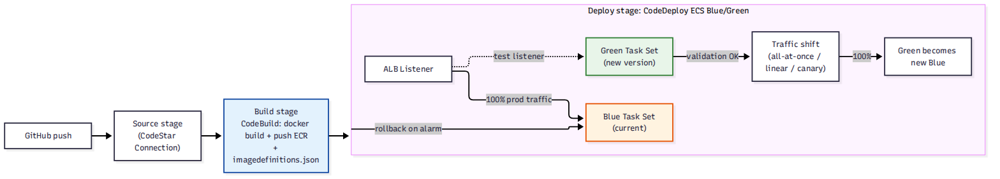

# 📚 Day 66 — Full CI/CD Pipeline to ECS: Blue/Green Deploy

> 📊 **Visual Summary** — সহজে বোঝার জন্য diagram:



**সময়:** ২ ঘণ্টা | **Module:** ১১ (CI/CD: CodePipeline & CodeBuild) — Day 3

## 🎯 আজকের লক্ষ্য
- CodePipeline + CodeBuild + ECS মিলিয়ে সম্পূর্ণ পাইপলাইন (Module 10-এর সাথে সংযোগ)
- **ECS Rolling Update** বনাম **CodeDeploy Blue/Green** deploy
- `imagedefinitions.json` কীভাবে ECS deploy action ব্যবহার করে
- Traffic shifting: all-at-once, linear, canary
- **CloudWatch Alarm** দিয়ে automatic rollback
- Test listener দিয়ে production traffic-এর আগে validation

---

## Part 1: ECS Deploy Action — সরল Rolling Update

CodePipeline-এর "Amazon ECS" deploy action সবচেয়ে সহজ পথ — Day 60-এর ECS Service rolling deployment ব্যবহার করে।

```
Build stage output: imagedefinitions.json = [{"name": "web", "imageUri": "<account>.dkr.ecr.../myapp:abc123"}]
                                    │
                                    ▼
ECS Deploy action ──► নতুন Task Definition revision তৈরি (নতুন image দিয়ে) ──► Service আপডেট (rolling)
```

**সীমাবদ্ধতা:** Rolling update-এ পুরনো আর নতুন task একসাথে কিছুক্ষণ চলে, কিন্তু **instant rollback** কঠিন (আগের task ইতিমধ্যে বন্ধ হয়ে যেতে পারে) এবং production traffic-এ নতুন version টেস্ট না করেই ছেড়ে দেওয়া হয়।

---

## Part 2: CodeDeploy দিয়ে ECS Blue/Green (উন্নত পদ্ধতি)

Day 21-এ CodeDeploy দেখেছেন EC2-তে; এখন একই সার্ভিস **ECS-এর জন্যও** blue/green deploy করতে পারে।

```
Blue Task Set (বর্তমান, 100% production traffic)
Green Task Set (নতুন version, শুরুতে traffic নেই)
        │
        ▼ Test listener দিয়ে Green যাচাই (production traffic ছাড়াই)
        │
        ▼ Traffic shift শুরু (CodeDeploy AppSpec-এ নির্ধারিত)
        │
Green 100% traffic পেলে ──► Blue বন্ধ হয়ে যায় (বা কিছুক্ষণ রাখা হয় দ্রুত rollback-এর জন্য)
```

### Traffic Shifting Option
| ধরন | আচরণ |
|---|---|
| **All-at-once** | সাথে সাথে ১০০% Green-এ শিফট |
| **Linear** | নির্দিষ্ট % প্রতি নির্দিষ্ট মিনিটে (যেমন প্রতি মিনিটে ১০%) |
| **Canary** | প্রথমে একটা ছোট % (যেমন ১০%), কিছুক্ষণ পর্যবেক্ষণ, তারপর বাকি ৯০% |

### AppSpec.yml (ECS-এর জন্য)
```yaml
version: 0.0
Resources:
  - TargetService:
      Type: AWS::ECS::Service
      Properties:
        TaskDefinition: <TASK_DEFINITION>
        LoadBalancerInfo:
          ContainerName: "web"
          ContainerPort: 3000
```

---

## Part 3: CloudWatch Alarm দিয়ে Automatic Rollback

Blue/Green deploy-এর সবচেয়ে বড় সুবিধা — **CloudWatch Alarm** (যেমন `5xxError` rate বা `TargetResponseTime`) attach করা যায়। Deploy চলাকালীন alarm ট্রিগার হলে CodeDeploy **automatically** পুরনো Blue-তে ফিরে যায়, কোনো manual intervention ছাড়াই।

```
Traffic shift চলাকালীন ──► CloudWatch Alarm ট্রিগার (5xx বেড়ে গেছে) ──► Automatic rollback to Blue
```

এটা Day 18 (blue/green deployment ধারণা) আর Day 53 (Security Hub finding-এ automated response)-এর মতোই দর্শন — মানুষ বসে না থেকে automation নিজে থেকে সিদ্ধান্ত নেয়।

---

## Part 4: Rolling বনাম Blue/Green — কবে কোনটা

| | **ECS Rolling (সরাসরি)** | **CodeDeploy Blue/Green** |
|---|---|---|
| জটিলতা | কম, দ্রুত সেটআপ | বেশি (দুই target group, test listener) |
| Rollback | ধীর/ম্যানুয়াল | দ্রুত, automatic (alarm-based) |
| Production traffic টেস্ট | না (সরাসরি shift) | হ্যাঁ (test listener দিয়ে) |
| উপযুক্ত | Dev/staging, কম-ঝুঁকির সার্ভিস | Production, customer-facing সার্ভিস |

---

## Part 5: Hands-on Lab

1. Day 65-এর পাইপলাইনে একটা ECS deploy action যোগ করুন (rolling)
2. একই সার্ভিসকে CodeDeploy Blue/Green deploy action-এ পরিবর্তন করুন
3. দুটো target group (blue/green) আর একটা test listener সহ ALB সেটআপ করুন
4. Linear traffic shifting (১০ মিনিটে ১০% করে) কনফিগার করুন
5. একটা CloudWatch Alarm (5xx error rate) attach করুন rollback trigger হিসেবে
6. একটা "খারাপ" deployment চালিয়ে (ইচ্ছাকৃত এরর ফেরত দেওয়া কোড) automatic rollback দেখুন

---

## 🎯 আজকের মূল Takeaways
- `imagedefinitions.json` ECS deploy action-কে বলে দেয় কোন নতুন image ব্যবহার করতে হবে
- Rolling update সহজ কিন্তু rollback ধীর; Blue/Green জটিল কিন্তু দ্রুত, safe rollback দেয়
- Test listener দিয়ে production traffic ছাড়াই নতুন version validate করা যায়
- CloudWatch Alarm attach করলে rollback পুরোপুরি automatic হয়ে যায়

## 📝 Self-check Questions
1. Rolling update-এ instant rollback কঠিন কেন?
2. Canary আর Linear traffic shifting-এর পার্থক্য কী?
3. Test listener কীভাবে "production-এ না ছেড়েই টেস্ট করা" সম্ভব করে?
4. CloudWatch Alarm attach করা না থাকলে খারাপ deployment-এ কী হবে?

## 💡 Pro Tips
- Customer-facing production সার্ভিসে সবসময় CloudWatch Alarm-সহ Blue/Green ব্যবহার করুন
- Canary দিয়ে শুরু করুন যদি নিশ্চিত না থাকেন নতুন version কতটা স্থিতিশীল
- Alarm metric বাছার সময় সত্যিকারের user impact প্রতিফলিত করে এমন metric বাছুন (শুধু CPU না, error rate/latency)
- Test listener-এ internal/QA traffic দিয়ে manual smoke test করার সুযোগ রাখুন automatic shift শুরুর আগে

## 🎨 Quick Reference
```
ECS Rolling: সহজ, দ্রুত, manual/ধীর rollback, dev/staging-এর জন্য উপযুক্ত
CodeDeploy Blue/Green: test listener + traffic shift (all-at-once/linear/canary) + automatic alarm-based rollback
imagedefinitions.json: CodeBuild output → ECS deploy action input
```

## 🚨 বাস্তব পরিস্থিতি (যেসব ভুল প্রায়ই হয়)

**পরিস্থিতি ১:** ECS rolling update দিয়ে একটা ভাঙা version deploy হলো, পুরনো task ততক্ষণে বন্ধ হয়ে গেছে — rollback করতে নতুন করে পুরনো image দিয়ে আবার deploy করতে হলো, কয়েক মিনিট downtime।
**শিক্ষা:** Customer-facing production সার্ভিসে Blue/Green + automatic rollback ব্যবহার করুন।

**পরিস্থিতি ২:** CloudWatch Alarm attach করা ছিল, কিন্তু threshold এত ঢিলা ছিল যে আসল সমস্যাতেও ট্রিগার হলো না।
**শিক্ষা:** Alarm threshold বাস্তবসম্মতভাবে সেট করুন, নিয়মিত রিভিউ করুন।

---

**⏮ আগের দিন:** [Day 65 — CodePipeline: Stage, Action ও Artifact](./Day-65-CodePipeline-Fundamentals-Stages-Actions.md) | **⏭ পরের দিন:** [Day 67 — Pipeline Security ও Advanced Patterns](./Day-67-Pipeline-Security-Advanced-Patterns.md)
