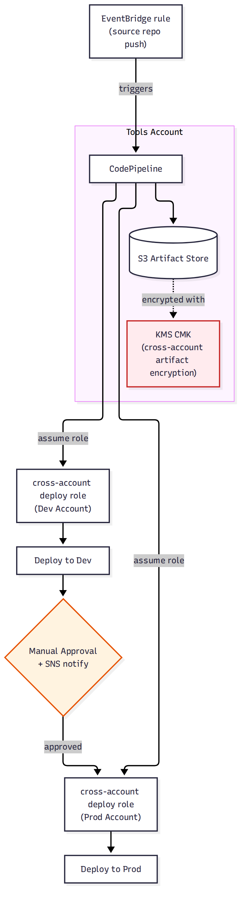

# 📚 Day 67 — Pipeline Security ও Advanced Patterns

> 📊 **Visual Summary** — সহজে বোঝার জন্য diagram:



**সময়:** ২ ঘণ্টা | **Module:** ১১ (CI/CD: CodePipeline & CodeBuild) — Day 4

## 🎯 আজকের লক্ষ্য
- Pipeline-এর IAM Role: least-privilege ডিজাইন (CodePipeline role, CodeBuild role, Deploy role)
- **Cross-account pipeline**: এক account থেকে dev/staging/prod আলাদা account-এ deploy (Day 40-এর multi-account-এর সাথে সংযোগ)
- Artifact encryption: KMS দিয়ে cross-account S3 artifact access
- **EventBridge** দিয়ে pipeline trigger (S3, ECR image push, scheduled)
- Secrets ও Parameter Store ইন্টিগ্রেশন
- Pipeline-as-Code (CloudFormation/CDK)

---

## Part 1: Pipeline-এর IAM Role — তিন স্তরের Permission

একটা CI/CD পাইপলাইনে কমপক্ষে ৩টা ভিন্ন role থাকে, প্রতিটার permission আলাদা রাখা উচিত (Day 60-এর Task Role/Execution Role আলাদা রাখার নীতির মতোই):

| Role | কী পারবে |
|---|---|
| **CodePipeline service role** | Artifact S3 bucket-এ read/write, CodeBuild/CodeDeploy শুরু করার permission |
| **CodeBuild service role** | ECR push, CloudWatch Logs, Parameter Store/Secrets Manager read |
| **Deploy role (CodeDeploy/ECS)** | শুধু deploy target (ECS service, EC2) manage করার permission |

> **নীতি:** কোনো role-কেই "AdministratorAccess" দেবেন না — প্রতিটা শুধু তার কাজের জন্য প্রয়োজনীয় সার্ভিসেই access পাবে।

---

## Part 2: Cross-Account Pipeline — Multi-Account Deployment (Day 40-এর সাথে সংযোগ)

**সমস্যা:** নিরাপত্তার জন্য dev/staging/prod আলাদা AWS account-এ রাখা ভালো (Day 40), কিন্তু পাইপলাইন একটাই জায়গা থেকে (Tools account) সব জায়গায় deploy করতে চায়।

**সমাধান:** পাইপলাইন **Tools account**-এ থাকে, প্রতিটা target account-এ একটা **cross-account IAM role** (AssumeRole, Day 52-এর সাথে সংযোগ) তৈরি করা হয়, যা শুধু Tools account-এর পাইপলাইনকে trust করে।

```
Tools Account (পাইপলাইন) ──assume role──► Dev Account (deploy role) ──► Deploy to Dev
                          ──assume role──► Prod Account (deploy role) ──► Deploy to Prod
```

### Artifact Encryption — Cross-Account S3 Access
Artifact store (S3) Tools account-এ থাকে, কিন্তু অন্য account-এর role-কে সেই artifact পড়তে দিতে হয় — এর জন্য একটা **customer-managed KMS key** ব্যবহার করা হয়, যার key policy-তে target account-গুলোকে decrypt permission দেওয়া থাকে।

---

## Part 3: EventBridge দিয়ে Pipeline Trigger (Day 31-এর সাথে সংযোগ)

Default-এ source repo-তে push হলেই pipeline চলে, কিন্তু আরও নমনীয় trigger দরকার হতে পারে:

```
S3 bucket-এ নতুন ফাইল আপলোড ──► EventBridge rule ──► Pipeline trigger
ECR-এ নতুন image push (base image আপডেট) ──► EventBridge rule ──► Downstream pipeline trigger
নির্দিষ্ট সময়ে (cron) ──► EventBridge scheduled rule ──► Pipeline trigger (nightly build)
```

---

## Part 4: Secrets ও Configuration — Parameter Store / Secrets Manager

Buildspec/Deploy-এ hardcode না করে:
- **SSM Parameter Store**: নন-সেনসিটিভ কনফিগ (API endpoint, feature flag) — ফ্রি
- **Secrets Manager**: sensitive credential (DB password, API key) — automatic rotation-সহ (Day 52)

```yaml
# buildspec.yml-এ
env:
  parameter-store:
    DB_HOST: "/myapp/prod/db-host"
  secrets-manager:
    DB_PASSWORD: "myapp/prod/db-credentials:password"
```

---

## Part 5: Pipeline-as-Code

Console-এ ক্লিক করে পাইপলাইন বানানো demo-র জন্য ঠিক আছে, কিন্তু production-এ **CloudFormation** বা **AWS CDK** দিয়ে পাইপলাইন define করা উচিত — reproducible, version-controlled, review করা যায় (pull request-এর মতোই)।

```
পাইপলাইন definition নিজেই একটা কোড ──► Git-এ কমিট ──► "Pipeline deploys itself" pattern (self-mutating pipeline, CDK Pipelines-এ common)
```

---

## Part 6: Hands-on Lab

1. পাইপলাইনের CodePipeline/CodeBuild/Deploy role — প্রতিটার policy খুলে দেখুন কতটা প্রশস্ত, প্রয়োজনে সংকুচিত করুন
2. একটা secret buildspec-এ hardcode না করে Secrets Manager থেকে টানুন
3. একটা EventBridge rule দিয়ে scheduled (cron) pipeline trigger সেটআপ করুন
4. (ঐচ্ছিক, খরচ সচেতন) দুই account-এর মধ্যে cross-account role trust সেটআপ করে একটা টেস্ট deploy করুন
5. পুরো পাইপলাইন CloudFormation template-এ রূপান্তর করুন

---

## 🎯 আজকের মূল Takeaways
- প্রতিটা pipeline role আলাদা, least-privilege — একই role সব জায়গায় ব্যবহার করবেন না
- Cross-account deploy-তে AssumeRole + KMS key policy দিয়ে artifact access দেওয়া হয়
- EventBridge দিয়ে push ছাড়াও অনেক ধরনের trigger (S3, ECR, cron) যোগ করা যায়
- Secrets buildspec-এ hardcode না করে Parameter Store/Secrets Manager থেকে টানুন
- Pipeline definition-ও কোড হিসেবে ট্রিট করুন (IaC), ম্যানুয়াল console click না

## 📝 Self-check Questions
1. CodePipeline role-কে "AdministratorAccess" দিলে কী ঝুঁকি তৈরি হয়?
2. Cross-account deploy-তে artifact S3 bucket-এর encryption key নিয়ে বিশেষ কী ব্যবস্থা দরকার?
3. EventBridge দিয়ে কোন কোন ধরনের trigger যোগ করা যায় শুধু "push" ছাড়া?
4. Pipeline-as-Code (CloudFormation/CDK) console-এ ক্লিক করে বানানোর চেয়ে ভালো কেন?

## 💡 Pro Tips
- প্রতিটা role-এর policy নিয়মিত রিভিউ করুন (IAM Access Analyzer, Day 51) — সময়ের সাথে over-permission জমে যায়
- Cross-account pipeline সেটআপ করলে প্রতিটা target account-এর role trust policy-তে শুধু Tools account-কেই specific করে অনুমতি দিন
- CDK Pipelines ব্যবহার করলে "self-mutating pipeline" পাওয়া যায় — pipeline নিজেই নিজের কোড আপডেট হলে নিজেকে redeploy করে
- Scheduled pipeline trigger নিয়মিত dependency update/security patch build-এর জন্য কাজে লাগে

## 🎨 Quick Reference
```
3 roles: CodePipeline (orchestrate) | CodeBuild (build+push) | Deploy (target manage)
Cross-account: AssumeRole + KMS key policy (artifact decrypt permission)
EventBridge trigger: repo push | S3 upload | ECR image push | scheduled (cron)
Secrets: SSM Parameter Store (non-sensitive) | Secrets Manager (sensitive, rotation)
Pipeline-as-Code: CloudFormation / CDK, reviewed via PR
```

## 🚨 বাস্তব পরিস্থিতি (যেসব ভুল প্রায়ই হয়)

**পরিস্থিতি ১:** CodeBuild role-এ ভুলে `*` resource-এ পুরো S3 access দেওয়া ছিল, একটা compromised dependency পুরো account-এর সব bucket পড়ে ফেলতে পারত।
**শিক্ষা:** Role-কে শুধু নির্দিষ্ট bucket/resource-এ scope করুন, wildcard এড়িয়ে চলুন।

**পরিস্থিতি ২:** Cross-account pipeline সেটআপ করার সময় artifact bucket-এর default AWS-managed key ব্যবহার করা হয়েছিল, ফলে অন্য account decrypt করতে পারছিল না।
**শিক্ষা:** Cross-account artifact access-এর জন্য customer-managed KMS key ব্যবহার করুন, key policy-তে target account যোগ করুন।

---

**⏮ আগের দিন:** [Day 66 — Full CI/CD Pipeline to ECS: Blue/Green Deploy](./Day-66-CodePipeline-ECS-BlueGreen-Deploy.md) | **⏭ পরের দিন:** [Day 68 — Module 11 Revision + Project: End-to-End CI/CD Pipeline](./Day-68-Module-11-Revision-End-to-End-CICD-Project.md)
