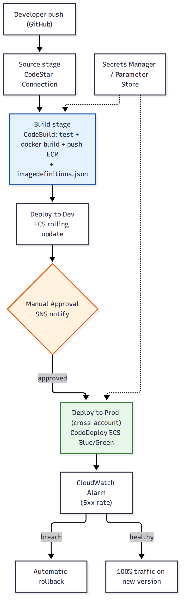

# 📚 Day 68 — Module 11 Revision + Project: End-to-End CI/CD Pipeline

> 📊 **Visual Summary** — সহজে বোঝার জন্য diagram:



**সময়:** ২ ঘণ্টা | **Module:** ১১ (CI/CD: CodePipeline & CodeBuild) — Day 5 (শেষ দিন)

## 🎯 আজকের লক্ষ্য
- পুরো Module 11 এক নজরে revision
- Project: "ShopBD"-এর containerized microservices (Module 10)-এর জন্য সম্পূর্ণ CI/CD পাইপলাইন
- Production CI/CD checklist ও Final quiz

---

# 🔁 Module 11 Revision

## 🗺 পুরো Module এক নজরে

| Day | বিষয় | এক লাইনে মনে রাখুন |
|---|---|---|
| 64 | CodeBuild, buildspec.yml | ৪টা phase: install → pre_build → build → post_build; যেকোনোটা fail করলে build থামে |
| 65 | CodePipeline, Stage/Action | CodePipeline = orchestrator; artifact S3-এর মাধ্যমে stage-থেকে-stage পাস হয় |
| 66 | ECS Deploy: Rolling বনাম Blue/Green | Rolling = সহজ কিন্তু ধীর rollback; Blue/Green = test listener + automatic alarm-based rollback |
| 67 | Pipeline Security, Cross-account | ৩ ভিন্ন role (least-privilege); cross-account deploy = AssumeRole + KMS key policy |

## 🧭 সিদ্ধান্ত গাইড

```
Build service নিজে হোস্ট করবেন, নাকি managed?      → CodeBuild (managed, per-minute বিল)
পুরো CI/CD workflow কে orchestrate করবে?           → CodePipeline
Deploy target ECS, production-facing?              → CodeDeploy Blue/Green + CloudWatch Alarm rollback
Deploy target ECS, dev/staging, কম ঝুঁকি?          → ECS rolling deploy action যথেষ্ট
Multi-account (dev/staging/prod আলাদা account)?    → Cross-account pipeline (AssumeRole + KMS)
Secret/credential দরকার build/deploy-তে?           → Parameter Store (non-sensitive) / Secrets Manager (sensitive)
GitHub-কেন্দ্রিক টিম, general-purpose CI?          → GitHub Actions (Day 21) বিবেচনা করুন, বা দুটো মিলিয়ে
```

---

# 🛠 Project: "ShopBD" — End-to-End CI/CD Pipeline

## Requirement (Module 10-এর containerized microservices-এর জন্য)
- প্রতিটা microservice (`api-gateway`, `orders-service`, `payments-service`) স্বাধীনভাবে build ও deploy হবে
- GitHub-এ push হলে automatically build ও test চলবে
- Dev environment-এ automatic deploy, কিন্তু **production-এ যাওয়ার আগে manual approval**
- Production deploy **zero-downtime** ও **automatic rollback**-সহ হতে হবে
- Dev, Staging, Prod আলাদা AWS account-এ (Day 40-এর multi-account কাঠামো)
- DB credential (Aurora/DynamoDB, Module 9) buildspec/deploy-তে কোথাও hardcode হবে না

## Architecture ও ধাপে ধাপে সিদ্ধান্ত

### ১. Source ও Build (Day 64–65)
```
GitHub (orders-service repo) ──CodeStar Connection──► CodePipeline Source stage
                                                      ──► CodeBuild: npm test → docker build → ECR push
```
প্রতিটা microservice-এর নিজস্ব পাইপলাইন (Day 60-এর "প্রতিটা service independently deployable" নীতির সম্প্রসারণ)।

### ২. Dev Deploy — সহজ Rolling (Day 66)
```
Build stage ──► ECS Deploy action (Dev account, rolling update) ──► orders-service (Dev cluster)
```
দ্রুত iteration দরকার dev-তে, তাই সরল rolling update যথেষ্ট।

### ৩. Manual Approval (Day 65)
```
Dev deploy সফল ──► Manual Approval action (SNS → Slack) ──► কেউ অনুমোদন না দিলে থেমে থাকে
```

### ৪. Prod Deploy — Cross-Account Blue/Green (Day 66–67)
```
Approval ──► AssumeRole (Prod account deploy role) ──► CodeDeploy ECS Blue/Green
           ──► Test listener দিয়ে Green validate ──► Linear traffic shift (10%/min)
           ──► CloudWatch Alarm (5xx rate) মনিটর ──► সমস্যা হলে automatic rollback
```

### ৫. Secrets ও Config (Day 67, Module 9-এর সাথে সংযোগ)
- Aurora/DynamoDB credential → **Secrets Manager**, buildspec-এ `secrets-manager` mapping দিয়ে inject
- Environment-specific config (API endpoint, feature flag) → **Parameter Store**, environment অনুযায়ী আলাদা path (`/orders-service/dev/...`, `/orders-service/prod/...`)

### ৬. Pipeline-as-Code (Day 67)
- পুরো পাইপলাইন CloudFormation template হিসেবে সংজ্ঞায়িত, একটা `infra` repo-তে version-controlled

## ✅ Production CI/CD Checklist
- [ ] প্রতিটা microservice-এর নিজস্ব পাইপলাইন, independently deployable
- [ ] Test `pre_build`/`build` phase-এ, push-এর আগে fail করে যেন ভাঙা কোড ECR-এ না যায়
- [ ] Dev-এ দ্রুত rolling deploy, Prod-এ Blue/Green + CloudWatch Alarm rollback
- [ ] Production deploy-এর আগে Manual Approval gate
- [ ] Cross-account deploy হলে least-privilege AssumeRole + customer-managed KMS key
- [ ] সব secret Secrets Manager/Parameter Store থেকে, কোথাও hardcode না
- [ ] প্রতিটা pipeline role (CodePipeline/CodeBuild/Deploy) আলাদা ও least-privilege
- [ ] Artifact bucket-এ lifecycle policy (পুরনো artifact পরিষ্কার)
- [ ] পাইপলাইন definition IaC-তে, PR review-এর মাধ্যমে পরিবর্তন হয়

---

## 📝 Module 11 Final Quiz

1. `buildspec.yml`-এর কোন phase-এ test চালানো উচিত, আর কেন?
2. CodePipeline আর CodeBuild-এর মধ্যে দায়িত্বের পার্থক্য কী?
3. Production deploy-এ Blue/Green কেন Rolling-এর চেয়ে নিরাপদ?
4. Cross-account pipeline-এ artifact bucket-এ কেন customer-managed KMS key দরকার?

### 🎓 Exam-ধাঁচের প্রশ্ন

**Q5.** A company wants its production ECS deployment to automatically roll back if the error rate spikes after a new version is released, without any manual intervention. What should be configured?
- A. ECS rolling update with a high minimum healthy percent
- B. CodeDeploy Blue/Green deployment with a CloudWatch Alarm attached
- C. A manual approval action before the deploy stage
- D. CodeBuild with a post_build health check script

**Q6.** A CI/CD pipeline in a "Tools" account must deploy to separate AWS accounts for Dev and Prod, while artifacts remain encrypted. What is required?
- A. IAM users created in each target account with long-term access keys
- B. Cross-account IAM roles (AssumeRole) plus a customer-managed KMS key with a key policy allowing the target accounts
- C. Copying the artifact S3 bucket into each target account
- D. Disabling encryption on the artifact bucket for simplicity

<details><summary>▶ উত্তর দেখুন</summary>

1. `pre_build` (বা `build`-এর শুরুতে) — যাতে ভাঙা কোড `post_build`-এ push হওয়ার আগেই ধরা পড়ে।
2. CodePipeline পুরো workflow orchestrate করে (কখন কোন stage চলবে); CodeBuild শুধু build/test/compile-এর আসল কাজ করে।
3. Blue/Green-এ test listener দিয়ে production traffic ছাড়াই নতুন version যাচাই করা যায়, আর CloudWatch Alarm দিয়ে সমস্যা হলে দ্রুত, automatic rollback হয় — Rolling-এ এই সুরক্ষা নেই।
4. Target account-গুলোর নিজস্ব credential দিয়ে Tools account-এর S3 bucket-এ থাকা encrypted artifact decrypt করতে হয়; এর জন্য key policy-তে target account-কে অনুমতি দেওয়া KMS key দরকার, AWS-managed key দিয়ে এটা সম্ভব না।
5. **B**: শুধু CloudWatch Alarm-সহ Blue/Green deployment automatic, alarm-triggered rollback দেয়।
6. **B**: Cross-account IAM role (দীর্ঘস্থায়ী access key না) আর customer-managed KMS key-ই নিরাপদ, স্কেলযোগ্য সমাধান।
</details>

---

## 💡 Pro Tips

- CI/CD পাইপলাইন নিজেও একটা প্রোডাকশন সিস্টেম — একে security (Module 8), IAM least-privilege, ও monitoring-এর একই মান দিয়ে ট্রিট করুন
- Module 9 (database), Module 10 (container), Module 11 (CI/CD) — এই তিনটা মিলিয়েই একটা বাস্তব প্রোডাকশন সিস্টেম তৈরি হয়; একটাতে দুর্বলতা থাকলে বাকি দুটো যতই ভালো হোক লাভ নেই
- প্রথমেই cross-account/Blue-Green-এর মতো জটিল সেটআপে না গিয়ে simple rolling pipeline দিয়ে শুরু করুন, ধাপে ধাপে maturity বাড়ান
- "Pipeline নিজেই একটা প্রোডাক্ট" — এটাকেও monitor করুন (pipeline failure rate, average deploy time)

---

## 🚨 বাস্তব পরিস্থিতি (যেসব ভুল প্রায়ই হয়)

**পরিস্থিতি ১:** একটা টিম dev-তে যেভাবে কাজ করত ঠিক সেই simple rolling pipeline production-এও ব্যবহার করল। একটা ভাঙা release পুরো production-এ ছড়িয়ে পড়ল, rollback করতে ৩০ মিনিট লাগল।
**শিক্ষা:** Dev আর Prod-এর deployment strategy আলাদা হওয়া উচিত — ঝুঁকি অনুযায়ী।

**পরিস্থিতি ২:** DB password buildspec.yml-এ plain environment variable হিসেবে লেখা ছিল, যা Git history-তে থেকে গেল।
**শিক্ষা:** কোনো credential কখনো buildspec/appspec ফাইলে সরাসরি লিখবেন না, সবসময় Secrets Manager/Parameter Store reference ব্যবহার করুন।

**পরিস্থিতি ৩:** পুরো পাইপলাইন console-এ ম্যানুয়ালি বানানো হয়েছিল, একজন ইঞ্জিনিয়ার চলে যাওয়ার পর কেউ জানত না ঠিক কী কনফিগারেশন ছিল।
**শিক্ষা:** পাইপলাইন IaC-তে রাখুন, জ্ঞান একজন ব্যক্তির মাথায় আটকে থাকা উচিত না।

---

**⏮ আগের দিন:** [Day 67 — Pipeline Security ও Advanced Patterns](./Day-67-Pipeline-Security-Advanced-Patterns.md) | **⏭ পরের module:** [Day 69 — Cost Visibility](../13-Module-12-Cost-Optimization/Day-69-Cost-Visibility-Cost-Explorer-CUR-Tags.md)
