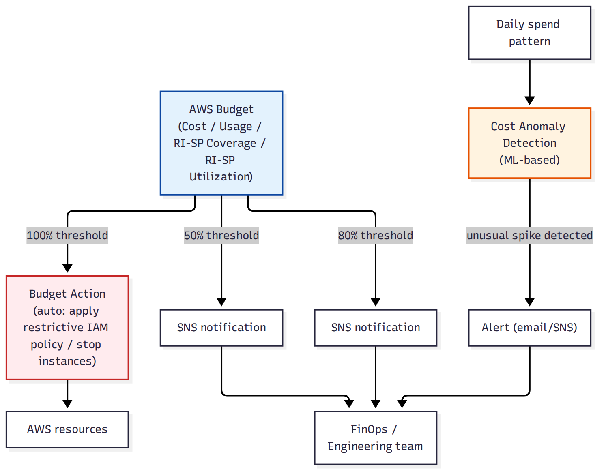

# 📚 Day 70 — AWS Budgets, Alerts ও Cost Anomaly Detection

> 📊 **Visual Summary** — সহজে বোঝার জন্য diagram:



**সময়:** ১.৫ ঘণ্টা | **Module:** ১২ (Cost Optimization & FinOps) — Day 2

## 🎯 আজকের লক্ষ্য
- **AWS Budgets**: Cost, Usage, RI/Savings Plans Coverage ও Utilization budget
- Threshold-based **alert** (SNS notification)
- **Budget Actions**: থ্রেশহোল্ড ছাড়ালে automatic response (IAM policy attach, EC2/RDS stop)
- **Cost Anomaly Detection**: ML-ভিত্তিক unusual spike শনাক্তকরণ (Budgets-এর "fixed threshold"-এর বিপরীতে)
- Budgets বনাম Cost Anomaly Detection — কবে কোনটা

---

## Part 1: AWS Budgets — Proactive Alerting

Cost Explorer (Day 69) **reactive** — যা হয়ে গেছে তা দেখায়। **AWS Budgets** **proactive** — নির্দিষ্ট থ্রেশহোল্ড ছাড়ালে আগেভাগে জানায়।

### Budget-এর ধরন
| ধরন | কী মাপে |
|---|---|
| **Cost Budget** | মোট খরচ (সবচেয়ে সাধারণ) |
| **Usage Budget** | নির্দিষ্ট resource-এর ব্যবহার (যেমন EC2 instance-hour) |
| **RI/Savings Plans Coverage** | কত % খরচ RI/SP দিয়ে কভার হচ্ছে (Day 6, Day 71-এর সাথে সংযোগ) |
| **RI/Savings Plans Utilization** | কেনা RI/SP কতটা আসলে ব্যবহার হচ্ছে (কম হলে টাকা নষ্ট) |

```
Budget: "Monthly EC2 cost ≤ $1000"
Threshold 50% ($500) ──► SNS alert: "আপনি অর্ধেক budget খরচ করেছেন"
Threshold 80% ($800) ──► SNS alert: "সতর্ক থাকুন"
Threshold 100% ($1000) ──► SNS alert + (ঐচ্ছিক) Budget Action
Forecasted 100% ──► আগেভাগে alert (এখনো পৌঁছায়নি কিন্তু trend অনুযায়ী পৌঁছাবে)
```

---

## Part 2: Budget Actions — Automatic Response

শুধু notification না, **Budget Actions** দিয়ে থ্রেশহোল্ড ছাড়ালে automatically ব্যবস্থা নেওয়া যায়:

- একটা **restrictive IAM policy** attach করে নতুন resource তৈরি বন্ধ করে দেওয়া
- নির্দিষ্ট EC2/RDS instance **stop** করে দেওয়া
- Service Control Policy (Day 52) apply করা (Organizations-এ)

> **সতর্কতা:** Production workload-এ automatic stop action ব্যবহারের আগে খুব ভালোভাবে চিন্তা করুন — dev/sandbox account-এ এটা নিরাপদ, কিন্তু production-এ ভুল থ্রেশহোল্ডে ব্যবসা বন্ধ হয়ে যেতে পারে।

---

## Part 3: Cost Anomaly Detection — ML-ভিত্তিক Spike শনাক্তকরণ

**সমস্যা:** Fixed threshold budget ($1000/month) দিয়ে ধীরে ধীরে বেড়ে যাওয়া খরচ ধরা পড়ে, কিন্তু **হঠাৎ অস্বাভাবিক spike** (যেমন সাধারণত $30/দিন খরচ, হঠাৎ একদিনে $500) সেই মাসের বাকি বাজেটের মধ্যে থাকলেও অলক্ষিত থেকে যেতে পারে।

**সমাধান: Cost Anomaly Detection** — আপনার সাধারণ spending pattern **machine learning দিয়ে শেখে**, তারপর সেই pattern থেকে অস্বাভাবিক বিচ্যুতি হলে সাথে সাথে alert পাঠায় — কোনো fixed threshold সেট করতে হয় না।

```
স্বাভাবিক প্যাটার্ন: প্রতিদিন ~$30 (কিছুটা ওঠানামা সহ)
হঠাৎ একদিন: $500 (কেউ ভুলে একটা বড় instance চালু রেখে গেছে, বা আক্রমণে resource তৈরি হচ্ছে)
──► Cost Anomaly Detection সাথে সাথে ধরে ফেলে, Budget-এর মাসিক থ্রেশহোল্ড এখনো না ছুঁলেও
```

### Budgets বনাম Anomaly Detection
| | **Budgets** | **Cost Anomaly Detection** |
|---|---|---|
| ভিত্তি | Fixed threshold (আপনি সেট করেন) | ML pattern-ভিত্তিক (automatic শেখে) |
| ধরে | ধীরে ধীরে বাজেট ছাড়ানো | হঠাৎ অস্বাভাবিক spike (এমনকি বাজেটের মধ্যেও) |
| Action | Alert + (ঐচ্ছিক) automatic action | শুধু Alert |

**একসাথে ব্যবহার:** দুটোই চালু রাখা best practice — Budgets দিয়ে overall ceiling, Anomaly Detection দিয়ে unexpected spike দ্রুত ধরা।

---

## Part 4: Hands-on Lab

1. একটা Cost Budget তৈরি করুন (মাসিক $50), threshold 50%/80%/100%-এ SNS alert যোগ করুন
2. একটা RI/Savings Plans Utilization budget তৈরি করুন
3. একটা Budget Action সেটআপ করুন (dev/sandbox account-এ, restrictive IAM policy attach করার জন্য)
4. Cost Anomaly Detection চালু করুন (Service monitor: সব সার্ভিস), alert subscription যোগ করুন
5. Console-এ গিয়ে দেখুন কোনো anomaly ইতিমধ্যে ধরা পড়েছে কিনা

---

## 🎯 আজকের মূল Takeaways
- Budgets proactive threshold alert দেয়; Cost Anomaly Detection ML দিয়ে pattern-বহির্ভূত spike ধরে
- Budget Actions দিয়ে automatic response সম্ভব, কিন্তু production-এ সতর্কতার সাথে ব্যবহার করুন
- RI/Savings Plans Coverage আর Utilization budget আলাদা জিনিস মাপে
- দুটো টুলই একসাথে ব্যবহার করাই best practice, একটা আরেকটার বিকল্প না

## 📝 Self-check Questions
1. Budget আর Cost Anomaly Detection-এর মূল পার্থক্য কী?
2. RI/SP Coverage আর RI/SP Utilization budget কী আলাদা প্রশ্নের উত্তর দেয়?
3. Budget Action production account-এ ব্যবহারে কী ঝুঁকি থাকতে পারে?
4. একটা ধীরে ধীরে বাড়তে থাকা খরচ আর একটা হঠাৎ spike — কোনটা কোন টুল দিয়ে ভালো ধরা পড়ে?

## 💡 Pro Tips
- প্রতিটা account-এ অন্তত একটা overall Cost Budget আর Cost Anomaly Detection দুটোই চালু রাখুন
- Budget Actions প্রথমে dev/sandbox account-এ টেস্ট করুন, production-এ সতর্কভাবে
- Alert শুধু একজনকে না পাঠিয়ে একটা টিম চ্যানেলে (SNS → Slack) পাঠান, যাতে কেউ ছুটিতে থাকলেও miss না হয়
- Forecasted alert (এখনো threshold না ছুঁলেও trend অনুযায়ী ছোঁবে) ব্যবহার করুন, শুধু actual threshold না

## 🎨 Quick Reference
```
Budget types: Cost | Usage | RI/SP Coverage | RI/SP Utilization
Alert threshold: actual % (50/80/100) বা forecasted
Budget Action: automatic IAM policy / stop instance (সতর্কতার সাথে, production-এ)
Cost Anomaly Detection: ML-ভিত্তিক, fixed threshold লাগে না, unexpected spike ধরে
```

## 🚨 বাস্তব পরিস্থিতি (যেসব ভুল প্রায়ই হয়)

**পরিস্থিতি ১:** কোনো Budget সেট করা ছিল না, মাস শেষে বিল স্বাভাবিকের ৫ গুণ — কেউ একটা বড় GPU instance টেস্টের পর বন্ধ করতে ভুলে গিয়েছিল।
**শিক্ষা:** সব account-এ Budget alert থাকা উচিত, এমনকি ছোট account-এও।

**পরিস্থিতি ২:** Budget ছিল $10,000/month, একদিনে $2,000 খরচ হয়ে গেল (আক্রমণে crypto-mining instance চালু), কিন্তু মাসিক বাজেট তখনো ছাড়ায়নি বলে কোনো alert আসেনি।
**শিক্ষা:** Cost Anomaly Detection চালু রাখুন, শুধু fixed monthly budget-এর উপর ভরসা করবেন না।

---

**⏮ আগের দিন:** [Day 69 — Cost Visibility](./Day-69-Cost-Visibility-Cost-Explorer-CUR-Tags.md) | **⏭ পরের দিন:** [Day 71 — Savings Plans, Reserved Instances ও Spot: EC2-এর বাইরেও](./Day-71-Savings-Plans-Reserved-Instances-Beyond-EC2.md)
