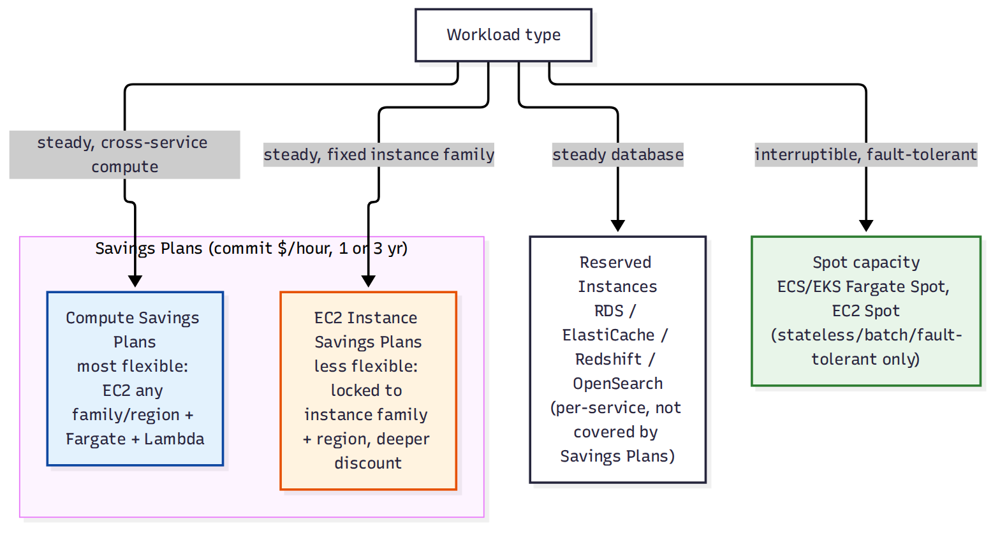

# 📚 Day 71 — Savings Plans, Reserved Instances ও Spot: EC2-এর বাইরেও

> 📊 **Visual Summary** — সহজে বোঝার জন্য diagram:



**সময়:** ২ ঘণ্টা | **Module:** ১২ (Cost Optimization & FinOps) — Day 3

## 🎯 আজকের লক্ষ্য
- **Compute Savings Plans** বনাম **EC2 Instance Savings Plans** — flexibility বনাম discount depth
- Savings Plans **EC2-ছাড়াও Fargate ও Lambda** কভার করে (Module 10-11-এর সাথে সংযোগ)
- **RDS/ElastiCache/Redshift/OpenSearch Reserved Instances** — ডেটাবেস purchasing option (Day 6-এর EC2 RI ধারণার সম্প্রসারণ)
- **Fargate Spot** ও **EC2 Spot** — কোন workload-এ নিরাপদ (Day 60-এর সাথে সংযোগ)
- একটা প্রকৃত multi-service architecture-এ purchasing option মেশানোর কৌশল

> **পূর্বশর্ত:** Day 6-এ On-Demand, Reserved Instances, Savings Plans, Spot-এর মূল ধারণা কভার হয়েছে EC2-এর প্রেক্ষাপটে। আজকের নোট সেই ভিত্তির উপর দাঁড়িয়ে **EC2-এর বাইরে** (Fargate, Lambda, RDS) এই একই ধারণাগুলো কীভাবে প্রযোজ্য তা দেখাবে — Day 6 আবার রিপিট করা হবে না।

---

## Part 1: Savings Plans-এর দুই ধরন — Flexibility বনাম Discount

Day 6-এ Savings Plans নামটা এসেছিল, আজ এর দুই ধরনের **trade-off** বুঝব:

| | **Compute Savings Plans** | **EC2 Instance Savings Plans** |
|---|---|---|
| Flexibility | সবচেয়ে বেশি — যেকোনো EC2 instance family/size/OS/region, **Fargate**, **Lambda** | কম — নির্দিষ্ট instance family + region-এ লক |
| Discount | তুলনামূলক কম | তুলনামূলক বেশি (flexibility ছেড়ে দেওয়ার বিনিময়ে) |
| উপযুক্ত | Multi-service architecture, compute mix বদলাতে পারে | খুব স্থিতিশীল, নির্দিষ্ট instance family-নির্ভর ওয়ার্কলোড |

```
কমিটমেন্ট: "$10/hour compute usage, 1 year" (Compute Savings Plans)
      │
      ├──► EC2 instance-এ ব্যবহার হলে discount
      ├──► Fargate task-এ ব্যবহার হলেও discount (Module 10)
      └──► Lambda-তে ব্যবহার হলেও discount (Module 4)
```

> **গুরুত্বপূর্ণ insight:** Fargate ব্যবহার করলেও (Day 60) Compute Savings Plans-এর মাধ্যমে discount পাওয়া যায় — "serverless মানেই discount নেই" এই ধারণা ভুল।

---

## Part 2: Reserved Instances — EC2-এর বাইরে (Database Services)

Day 6-এ EC2 RI দেখেছেন। একই ধারণা **ডেটাবেস সার্ভিসেও** প্রযোজ্য, কিন্তু Savings Plans এগুলো কভার করে না — আলাদাভাবে কিনতে হয়।

| সার্ভিস | RI প্রযোজ্য |
|---|---|
| **RDS** (Day 54-55) | হ্যাঁ — engine + instance class + region-এর জন্য কমিট |
| **ElastiCache** | হ্যাঁ |
| **Redshift** | হ্যাঁ |
| **OpenSearch** | হ্যাঁ |
| **DynamoDB** (Day 56-57) | RI না, বরং **Reserved Capacity** (provisioned mode-এর জন্য) |

```
Aurora Multi-AZ production DB (Day 55) সবসময় চালু থাকবে জানলে
    → 1-year বা 3-year RDS Reserved Instance কিনে On-Demand-এর তুলনায় উল্লেখযোগ্য সাশ্রয়
```

---

## Part 3: Spot — EC2-এর বাইরে (Fargate Spot, ECS/EKS)

Day 6-এ EC2 Spot দেখেছেন। Module 10-এর ECS/EKS-এও Spot ব্যবহার করা যায়:

- **Fargate Spot**: ECS/EKS-এ Fargate task Spot capacity-তে চালানো যায় (On-Demand Fargate-এর তুলনায় সস্তা)
- **EC2 Spot for ECS/EKS worker node**: Managed Node Group/Capacity Provider-এ Spot instance মেশানো যায়

### কোন workload-এ Spot নিরাপদ (Day 6-এর পুনরাবৃত্তি না, ব্যবহারিক প্রয়োগ)
```
✅ নিরাপদ: batch-worker (Day 63-এর মতো standalone task), stateless web tier (auto-scaled, interruption সহ্য করতে পারে)
❌ নিরাপদ না: single-instance database, stateful session store যার replica নেই
```

**ECS Capacity Provider Strategy** দিয়ে একটা Service-এ **Spot ও On-Demand/Fargate মিশ্রণ** করা যায় — যেমন 70% Fargate Spot + 30% Fargate On-Demand, যাতে সব task একসাথে interrupt না হয়।

---

## Part 4: Purchasing Option মেশানোর বাস্তব কৌশল

```
Baseline (সবসময় দরকার, predictable) → Reserved Instances / Savings Plans
Variable/peak traffic (ওঠানামা করে) → On-Demand
Fault-tolerant, interruption-tolerant, batch → Spot
```

এই তিন স্তরের মিশ্রণকে অনেক সময় বলা হয় **"RI/SP + On-Demand + Spot" pyramid** — বেশিরভাগ খরচ (baseline) সবচেয়ে সস্তা committed rate-এ, শুধু প্রয়োজনীয় flexibility-টুকু On-Demand/Spot-এ।

---

## Part 5: Hands-on Lab

1. Cost Explorer-এর "Savings Plans Recommendations" দেখুন — AWS নিজে কী পরিমাণ commitment suggest করছে
2. একটা RDS instance-এ Reserved Instance পার্চেজ সিমুলেট করুন (console-এ preview মূল্য দেখুন, actual না কিনে)
3. ECS Service-এ Capacity Provider Strategy দিয়ে FARGATE আর FARGATE_SPOT-এর মধ্যে ভাগ (যেমন 50/50) কনফিগার করুন
4. Cost Explorer-এ "RI/SP Utilization Report" দেখুন — একটা demo/existing commitment কতটা ব্যবহৃত হচ্ছে

---

## 🎯 আজকের মূল Takeaways
- Compute Savings Plans সবচেয়ে flexible (EC2+Fargate+Lambda জুড়ে), EC2 Instance Savings Plans বেশি discount কিন্তু কম flexible
- RDS/ElastiCache/Redshift/OpenSearch-এর নিজস্ব Reserved Instance আছে, Savings Plans এগুলো কভার করে না
- Fargate Spot দিয়ে container workload-এও Spot-এর সাশ্রয় পাওয়া যায়
- Baseline = RI/SP, variable = On-Demand, interruptible = Spot — এই তিন স্তরের কৌশল সবচেয়ে কার্যকর

## 📝 Self-check Questions
1. Compute Savings Plans কেন EC2 Instance Savings Plans-এর চেয়ে কম discount দেয়?
2. DynamoDB-এর জন্য "RI" না বলে কী বলা হয়?
3. Fargate Spot কোন ধরনের ECS task-এ ব্যবহার করা উচিত না?
4. একটা প্রোডাকশন Aurora ক্লাস্টার সবসময় চালু থাকবে জানলে কোন purchasing option বিবেচনা করবেন?

## 💡 Pro Tips
- বেশিরভাগ multi-service architecture-এ EC2 Instance Savings Plans-এর বদলে Compute Savings Plans বেশি ব্যবহারিক — architecture বদলালেও discount হারাবেন না
- RI/Savings Plans কেনার আগে AWS-এর নিজস্ব recommendation (Cost Explorer) দেখুন, আন্দাজে commitment করবেন না
- Fargate Spot ব্যবহার করলে সবসময় কিছু On-Demand/regular Fargate capacity রাখুন (capacity provider strategy), যাতে সব task একসাথে interrupt না হয়
- ১-বছর দিয়ে শুরু করুন Reserved commitment-এ, ৩-বছর তখনই করুন যখন workload সম্পর্কে খুব নিশ্চিত

## 🎨 Quick Reference
```
Compute Savings Plans: EC2 + Fargate + Lambda, সবচেয়ে flexible
EC2 Instance Savings Plans: শুধু নির্দিষ্ট EC2 family, বেশি discount, কম flexible
Database RI: RDS | ElastiCache | Redshift | OpenSearch (Savings Plans কভার করে না)
DynamoDB: Reserved Capacity (RI না)
Fargate Spot: ECS/EKS-এ Spot discount, capacity provider strategy দিয়ে On-Demand-এর সাথে মেশানো
কৌশল: Baseline → RI/SP | Variable → On-Demand | Interruptible → Spot
```

## 🚨 বাস্তব পরিস্থিতি (যেসব ভুল প্রায়ই হয়)

**পরিস্থিতি ১:** একটা টিম EC2 Instance Savings Plans কিনেছিল একটা নির্দিষ্ট instance family-তে, তারপর সেই workload Fargate-এ migrate করল — পুরো commitment অব্যবহৃত থেকে গেল।
**শিক্ষা:** Architecture বদলানোর সম্ভাবনা থাকলে Compute Savings Plans বেছে নিন।

**পরিস্থিতি ২:** একটা stateful, single-instance database EC2 Spot-এ চালানো হয়েছিল খরচ বাঁচাতে — Spot interruption-এ ডেটা হারানোর ঝুঁকিতে পড়ল।
**শিক্ষা:** Spot শুধু stateless/fault-tolerant/interruption-tolerant workload-এর জন্য।

---

**⏮ আগের দিন:** [Day 70 — Budgets, Alerts ও Anomaly Detection](./Day-70-Budgets-Alerts-Anomaly-Detection.md) | **⏭ পরের দিন:** [Day 72 — Trusted Advisor, Compute Optimizer ও Rightsizing](./Day-72-Trusted-Advisor-Compute-Optimizer-Rightsizing.md)
