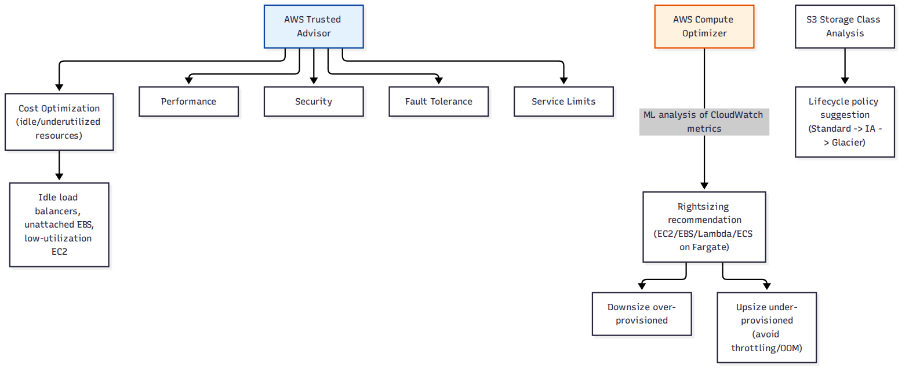

# 📚 Day 72 — Trusted Advisor, Compute Optimizer ও Rightsizing

> 📊 **Visual Summary** — সহজে বোঝার জন্য diagram:



**সময়:** ২ ঘণ্টা | **Module:** ১২ (Cost Optimization & FinOps) — Day 4

## 🎯 আজকের লক্ষ্য
- **AWS Trusted Advisor**: ৫টা ক্যাটাগরি (Cost, Performance, Security, Fault Tolerance, Service Limits)
- **AWS Compute Optimizer**: ML-ভিত্তিক rightsizing recommendation (EC2, EBS, Lambda, ECS on Fargate)
- Over-provisioning বনাম Under-provisioning — দুটোই সমস্যা
- **S3 Storage Class Analysis** ও lifecycle policy (Day 5-এর সাথে সংযোগ)
- Idle/unused resource খুঁজে বের করার checklist

---

## Part 1: AWS Trusted Advisor — ৫টা ক্যাটাগরির Automated Check

**Trusted Advisor** আপনার account স্ক্যান করে ৫টা ক্যাটাগরিতে সুপারিশ দেয়:

| ক্যাটাগরি | উদাহরণ চেক |
|---|---|
| **Cost Optimization** | Idle load balancer, unattached EBS volume, low-utilization EC2 instance, unused Elastic IP |
| **Performance** | Service limit-এর কাছাকাছি, high-utilization resource |
| **Security** | Public S3 bucket, MFA না থাকা root account (Day 3, Day 51-এর সাথে সংযোগ) |
| **Fault Tolerance** | Multi-AZ না থাকা RDS (Day 54), backup না থাকা |
| **Service Limits** | কোনো service quota-র কাছাকাছি পৌঁছে গেছেন কিনা |

> **Support Plan নির্ভরতা:** Basic/Developer support-এ শুধু কিছু core check ফ্রি; পুরো check list পেতে Business বা Enterprise support plan লাগে।

---

## Part 2: AWS Compute Optimizer — ML-ভিত্তিক Rightsizing

**সমস্যা:** একটা `m5.2xlarge` instance আসলে `m5.large`-এই চলতে পারত (over-provisioned), অথবা একটা `t3.small` লোড সামলাতে হিমশিম খাচ্ছে (under-provisioned) — ম্যানুয়ালি এটা বোঝা কঠিন।

**সমাধান: Compute Optimizer** — CloudWatch metric (CPU, memory, network) বিশ্লেষণ করে **নির্দিষ্ট instance type** সুপারিশ করে।

```
CloudWatch metrics (গত ১৪ দিন) ──► Compute Optimizer (ML analysis) ──► "m5.2xlarge থেকে m5.large-এ নামান, ৫০% সাশ্রয়"
```

### কোন resource কভার করে
- EC2 Instance
- EBS Volume (Day 4)
- Lambda Function (Day 22-27 — memory allocation rightsizing)
- ECS Service on Fargate (Day 60 — CPU/memory rightsizing)

### Over বনাম Under-provisioning
| | **Over-provisioned** | **Under-provisioned** |
|---|---|---|
| লক্ষণ | কম CPU/memory ব্যবহার, বেশি বিল | Throttling, OOM (out of memory), ধীর response |
| সমাধান | Downsize (ছোট instance type/less memory) | Upsize (বড় instance type/বেশি memory) |
| ঝুঁকি | শুধু খরচ | Performance/reliability সমস্যা |

> **গুরুত্বপূর্ণ:** Rightsizing শুধু "ছোট করা" না — under-provisioned resource **upsize** করাও সমান গুরুত্বপূর্ণ, নাহলে performance-এর মূল্যে সাশ্রয় হচ্ছে।

---

## Part 3: S3 Storage Class Analysis (Day 5-এর সাথে সংযোগ)

Day 5-এ S3 storage class (Standard, IA, Glacier) শিখেছেন। **S3 Storage Class Analysis** access pattern পর্যবেক্ষণ করে বলে দেয় কোন object কম access হচ্ছে, তার ভিত্তিতে lifecycle policy বানানো যায়।

```
Storage Class Analysis (৩০ দিন observe) ──► "এই prefix-এর object ৩০ দিন পর আর প্রায় access হয় না" ──► Lifecycle rule: 30 দিন পর Standard → Standard-IA
```

---

## Part 4: Idle/Unused Resource Checklist

Trusted Advisor Cost Optimization ক্যাটাগরির বাইরেও নিয়মিত ম্যানুয়ালি চেক করার মতো জিনিস:

```
[ ] Unattached EBS volume (instance terminate হওয়ার পরও volume থেকে যায়)
[ ] পুরনো EBS snapshot (dev/test-এর জন্য নেওয়া, আর দরকার নেই)
[ ] Elastic IP যা কোনো running instance-এর সাথে attached না (idle EIP-তে চার্জ হয়)
[ ] Idle Load Balancer (কোনো healthy target নেই)
[ ] পুরনো/অব্যবহৃত AMI ও তাদের সাথে যুক্ত snapshot
[ ] Stopped কিন্তু terminate না করা EC2 instance (storage-এর জন্য এখনো বিল হচ্ছে)
[ ] ECR-এ untagged পুরনো image (Day 59-এর lifecycle policy)
```

---

## Part 5: Hands-on Lab

1. Trusted Advisor-এ গিয়ে Cost Optimization ক্যাটাগরির সুপারিশ দেখুন (Basic support-এও কিছু কোর চেক ফ্রি)
2. Compute Optimizer enable করুন, ২৪-৪৮ ঘণ্টা পর EC2/Lambda-এর জন্য recommendation দেখুন
3. একটা S3 bucket-এ Storage Class Analysis চালু করুন
4. Console-এ গিয়ে unattached EBS volume ও idle Elastic IP খুঁজে বের করুন
5. একটা over-provisioned test EC2 instance-এ Compute Optimizer-এর সুপারিশ অনুযায়ী resize করুন

---

## 🎯 আজকের মূল Takeaways
- Trusted Advisor ৫টা ক্যাটাগরিতে automated check দেয়, কিছু check শুধু Business/Enterprise support-এ পুরোপুরি পাওয়া যায়
- Compute Optimizer ML দিয়ে EC2/EBS/Lambda/Fargate-এর সঠিক size সুপারিশ করে
- Rightsizing মানে শুধু downsize না — under-provisioned resource upsize করাও সমান গুরুত্বপূর্ণ
- S3 Storage Class Analysis lifecycle policy ডিজাইন করতে সাহায্য করে
- Unattached volume, idle EIP, stopped instance — নিয়মিত ম্যানুয়াল চেক করা দরকার

## 📝 Self-check Questions
1. Trusted Advisor-এর ৫টা ক্যাটাগরি কী কী?
2. Compute Optimizer কোন কোন AWS resource-এর জন্য recommendation দেয়?
3. Under-provisioned resource-এ কী সমস্যা হতে পারে, শুধু খরচ ছাড়া?
4. Stopped EC2 instance-এ কেন এখনো বিল হতে পারে?

## 💡 Pro Tips
- Rightsizing-কে একবারের কাজ না ভেবে চলমান প্রক্রিয়া হিসেবে দেখুন — workload সময়ের সাথে বদলায়
- Compute Optimizer-এর সুপারিশ production-এ apply করার আগে staging-এ টেস্ট করুন
- মাসে একবার idle/unused resource checklist ম্যানুয়ালি রিভিউ করুন, শুধু automated tool-এর উপর নির্ভর না
- Rightsizing শুধু cost না, performance-ও উন্নত করতে পারে (under-provisioned resource ঠিক করলে)

## 🎨 Quick Reference
```
Trusted Advisor: Cost | Performance | Security | Fault Tolerance | Service Limits
Compute Optimizer: EC2 | EBS | Lambda | ECS on Fargate — ML-ভিত্তিক rightsizing
Over-provisioned → downsize (সাশ্রয়) | Under-provisioned → upsize (performance)
S3 Storage Class Analysis → lifecycle policy design (Day 5)
Idle resource checklist: EBS, EIP, LB, snapshot, AMI, stopped instance, untagged ECR image
```

## 🚨 বাস্তব পরিস্থিতি (যেসব ভুল প্রায়ই হয়)

**পরিস্থিতি ১:** বছরখানেক আগে terminate করা EC2 instance-এর EBS volume কখনো মোছা হয়নি, প্রতি মাসে চুপচাপ বিল আসছিল।
**শিক্ষা:** নিয়মিত unattached volume চেক করুন, Trusted Advisor-এর Cost Optimization ট্যাব দেখুন।

**পরিস্থিতি ২:** একটা টিম শুধু "খরচ কমাতে হবে" ভেবে সব EC2 instance downsize করল, কিন্তু কিছু instance আসলে under-provisioned ছিল — performance খারাপ হয়ে গ্রাহক অভিযোগ শুরু হলো।
**শিক্ষা:** Rightsizing মানে শুধু downsize না, Compute Optimizer-এর প্রকৃত ডেটা-ভিত্তিক সুপারিশ অনুসরণ করুন।

---

**⏮ আগের দিন:** [Day 71 — Savings Plans, Reserved Instances ও Spot: EC2-এর বাইরেও](./Day-71-Savings-Plans-Reserved-Instances-Beyond-EC2.md) | **⏭ পরের দিন:** [Day 73 — Module 12 Revision + Project: FinOps Cost Optimization Plan](./Day-73-Module-12-Revision-FinOps-Cost-Optimization-Project.md)
