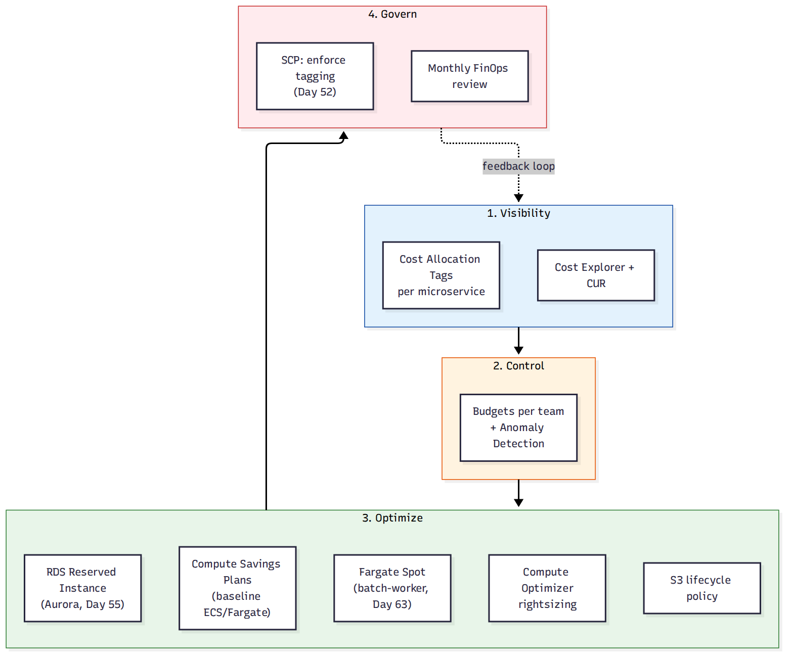

# 📚 Day 73 — Module 12 Revision + Project: FinOps Cost Optimization Plan

> 📊 **Visual Summary** — সহজে বোঝার জন্য diagram:



**সময়:** ২ ঘণ্টা | **Module:** ১২ (Cost Optimization & FinOps) — Day 5 (শেষ দিন)

## 🎯 আজকের লক্ষ্য
- পুরো Module 12 এক নজরে revision
- **FinOps** ধারণা: Visibility → Control → Optimize → Govern — একটা চলমান cycle
- Project: "ShopBD"-এর (Module 9-11-এর পুরো প্ল্যাটফর্ম) জন্য সম্পূর্ণ cost optimization প্ল্যান
- Production FinOps checklist ও Final quiz

---

# 🔁 Module 12 Revision

## 🗺 পুরো Module এক নজরে

| Day | বিষয় | এক লাইনে মনে রাখুন |
|---|---|---|
| 69 | Cost Explorer, CUR, Tags | Cost Explorer = UI trend; CUR = সবচেয়ে granular; Tag activate না করলে filter করা যায় না |
| 70 | Budgets, Anomaly Detection | Budgets = fixed threshold proactive alert; Anomaly Detection = ML-ভিত্তিক unexpected spike |
| 71 | Savings Plans/RI EC2-এর বাইরে | Compute SP (flexible, EC2+Fargate+Lambda) বনাম EC2 Instance SP (কম flexible, বেশি discount); DB-এর নিজস্ব RI |
| 72 | Trusted Advisor, Compute Optimizer | Trusted Advisor = ৫ ক্যাটাগরি automated check; Compute Optimizer = ML rightsizing (downsize ও upsize দুটোই) |

## 🧭 FinOps Cycle — একটা চলমান প্রক্রিয়া

```
1. Visibility: Tag enforce করা, Cost Explorer/CUR সেটআপ
2. Control: প্রতিটা team/project-এর জন্য Budget + Anomaly Detection
3. Optimize: Rightsizing (Compute Optimizer), Purchasing option (SP/RI/Spot), Storage lifecycle
4. Govern: SCP দিয়ে tagging enforce, নিয়মিত (মাসিক) review meeting
      │
      └──► আবার Visibility-তে ফিরে যায় (নতুন ডেটা, নতুন সিদ্ধান্ত) — একবারের কাজ না, চক্র
```

> **FinOps-এর মূল দর্শন:** Cost optimization একবার করে শেষ করার প্রজেক্ট না — এটা engineering, finance, ও leadership-এর মধ্যে একটা চলমান সহযোগিতা।

---

# 🛠 Project: "ShopBD" — FinOps Cost Optimization Plan

## প্রেক্ষাপট
ShopBD-র সম্পূর্ণ প্ল্যাটফর্ম এতদিনে তৈরি: Aurora + DynamoDB (Module 9), ECS/Fargate microservices (Module 10), CI/CD pipeline (Module 11)। এখন লক্ষ্য: **খরচ দৃশ্যমান, নিয়ন্ত্রিত ও optimized** রাখা।

## ধাপে ধাপে প্ল্যান

### ১. Visibility (Day 69)
- প্রতিটা microservice (`api-gateway`, `orders-service`, `payments-service`) ও প্রতিটা database resource-এ Tag: `Team`, `Service`, `Environment`
- Cost Allocation Tags activate, Cost Explorer-এ "Group by: Tag=Service" দিয়ে প্রতিটা microservice-এর নিজস্ব খরচ ট্র্যাক
- CUR সেটআপ, S3 → Athena, মাসিক automated cost report generate

### ২. Control (Day 70)
- প্রতিটা team-এর জন্য আলাদা Budget (Orders team, Payments team), 50/80/100% threshold alert Slack-এ
- সম্পূর্ণ account-এ Cost Anomaly Detection চালু, যেকোনো hঠাৎ spike-এ সাথে সাথে alert

### ৩. Optimize (Day 71–72)
- **Compute**: ECS/Fargate-এর baseline load-এর জন্য Compute Savings Plans কেনা (predictable ৭০% traffic কভার), বাকি ৩০% On-Demand
- **Batch worker** (Day 63): Fargate Spot ব্যবহার (interruption-tolerant, standalone task)
- **Database**: Aurora-এর Multi-AZ writer/reader-এর জন্য RDS Reserved Instance (স্থায়ী, ২৪/৭ চালু)
- **Rightsizing**: Compute Optimizer-এর সুপারিশ অনুযায়ী প্রতিটা ECS task-এর CPU/memory মাসিক রিভিউ করে adjust
- **Storage**: S3-তে থাকা পুরনো order invoice/log-এ lifecycle policy (৯০ দিন পর Glacier)

### ৪. Govern (Day 52, Day 67-এর সাথে সংযোগ)
- SCP দিয়ে enforce করা হয় — Tag ছাড়া কোনো resource তৈরি করা যাবে না (Day 52-এর SCP guardrail নীতি)
- মাসিক FinOps review মিটিং: Cost Explorer ড্যাশবোর্ড নিয়ে Engineering + Finance একসাথে বসে
- CI/CD pipeline (Module 11)-এ একটা automated check যোগ করা যায় যা নতুন resource-এ tag না থাকলে deploy আটকায়

## ✅ Production FinOps Checklist
- [ ] প্রতিটা resource-এ standard tag (Team, Service, Environment), enforce করা SCP/Config rule দিয়ে
- [ ] Cost Explorer + CUR + Athena সেটআপ, নিয়মিত (সাপ্তাহিক) রিভিউ
- [ ] প্রতিটা team/project-এর নিজস্ব Budget + alert threshold
- [ ] Cost Anomaly Detection সব account-এ চালু
- [ ] Baseline compute-এ Compute Savings Plans, database-এ Reserved Instance
- [ ] Interruption-tolerant workload-এ Spot/Fargate Spot ব্যবহার বিবেচনা করা
- [ ] Compute Optimizer সুপারিশ মাসিক রিভিউ (upsize ও downsize দুটোই)
- [ ] S3/storage-এ lifecycle policy, পুরনো snapshot/AMI পরিষ্কার
- [ ] মাসিক FinOps review মিটিং, শুধু IT না — Finance-ও অংশগ্রহণ করে

---

## 📝 Module 12 Final Quiz

1. Cost Explorer আর Cost Anomaly Detection-এর মধ্যে কোনটা "fixed threshold"-নির্ভর, আর কোনটা "pattern-ভিত্তিক"?
2. একটা multi-service architecture (EC2+Fargate+Lambda মেশানো) থাকলে কোন Savings Plans বেছে নেবেন, আর কেন?
3. Rightsizing-এ শুধু downsize-এর কথা ভাবলে কী ঝুঁকি তৈরি হয়?
4. FinOps-কে "একবারের প্রজেক্ট" না বলে "চলমান cycle" বলা হয় কেন?

### 🎓 Exam-ধাঁচের প্রশ্ন

**Q5.** A company runs a mix of EC2 instances, Fargate tasks, and Lambda functions with steady, predictable usage, but the instance types and services used may change over time. Which purchasing option provides savings with maximum flexibility?
- A. EC2 Instance Savings Plans
- B. Standard Reserved Instances
- C. Compute Savings Plans
- D. Spot Instances

**Q6.** A finance team wants to be alerted immediately if daily spend deviates unusually from the historical pattern, even if the monthly budget has not been exceeded. What should be used?
- A. A Cost Budget with a 100% threshold alert
- B. AWS Cost Anomaly Detection
- C. Trusted Advisor Cost Optimization checks
- D. AWS Compute Optimizer

<details><summary>▶ উত্তর দেখুন</summary>

1. Cost Explorer নিজে fixed threshold না, শুধু trend/history দেখায়; **Budgets** fixed threshold-ভিত্তিক (আপনি সেট করেন); **Cost Anomaly Detection** ML pattern-ভিত্তিক, কোনো fixed threshold লাগে না।
2. **Compute Savings Plans** — কারণ এটা EC2, Fargate, ও Lambda তিনটাতেই প্রযোজ্য, architecture বদলালেও commitment অব্যবহৃত থেকে যাবে না।
3. Under-provisioned resource-কে যদি rightsizing-এ শুধু "downsize" হিসেবে দেখা হয়, তাহলে আসলে যেসব resource-এর আরও capacity দরকার সেগুলো চিহ্নিত হবে না — performance/reliability সমস্যা তৈরি হতে পারে।
4. কারণ workload, traffic pattern, ও টিমের প্রয়োজন সময়ের সাথে বদলায় — একবার optimize করে রেখে দিলে কিছুদিন পরই আবার অদক্ষ হয়ে যায়; visibility-control-optimize-govern চক্র নিয়মিত repeat করতে হয়।
5. **C**: Compute Savings Plans একমাত্র option যা EC2, Fargate, ও Lambda তিনটাতেই প্রযোজ্য, architecture change-এও flexible থাকে।
6. **B**: Cost Anomaly Detection ML দিয়ে normal pattern শেখে এবং বাজেট থ্রেশহোল্ড না ছুঁলেও unexpected spike ধরতে পারে; Budget শুধু fixed threshold-ভিত্তিক।
</details>

---

## 💡 Pro Tips

- FinOps শুধু "খরচ কমানো" না — সঠিক জায়গায় সঠিক পরিমাণ খরচ করা, প্রয়োজনে বাড়ানোও (under-provisioned fix করা)
- Engineering টিমকে cost visibility দিন (Cost Explorer dashboard access) — যারা resource তৈরি করে তারাই সবচেয়ে ভালো optimize করতে পারে
- ছোট, নিয়মিত অভ্যাস (মাসিক রিভিউ, tag enforcement) বড় এক-কালীন "cost cutting project"-এর চেয়ে বেশি কার্যকর
- Module 8 (security), Module 9-11 (database/container/CI-CD) আর Module 12 (cost) — সবগুলো একসাথে একটা প্রকৃত প্রোডাকশন-রেডি সিস্টেমের ভিত্তি তৈরি করে

---

## 🚨 বাস্তব পরিস্থিতি (যেসব ভুল প্রায়ই হয়)

**পরিস্থিতি ১:** একটা কোম্পানি বছরে একবার "cost cutting week" চালাত, বাকি ১১ মাস কেউ খরচের দিকে তাকাত না — প্রতি বছর একই সমস্যাগুলো আবার জমা হতো।
**শিক্ষা:** FinOps-কে চলমান অভ্যাস বানান, বার্ষিক ইভেন্ট না।

**পরিস্থিতি ২:** Engineering টিমের কারো Cost Explorer-এ access ছিল না — শুধু Finance টিম বিল দেখত, কিন্তু তারা জানত না কোন resource আসলে দরকার আর কোনটা না।
**শিক্ষা:** যারা resource তৈরি/ব্যবহার করে তাদেরই cost visibility দিন, সিদ্ধান্ত কেন্দ্রীভূত রাখবেন না।

---

**⏮ আগের দিন:** [Day 72 — Trusted Advisor, Compute Optimizer ও Rightsizing](./Day-72-Trusted-Advisor-Compute-Optimizer-Rightsizing.md) | **⏭ পরের module:** [Day 74 — CloudFormation Fundamentals](../14-Module-13-Infrastructure-as-Code/Day-74-CloudFormation-Fundamentals-Template-Anatomy.md)
