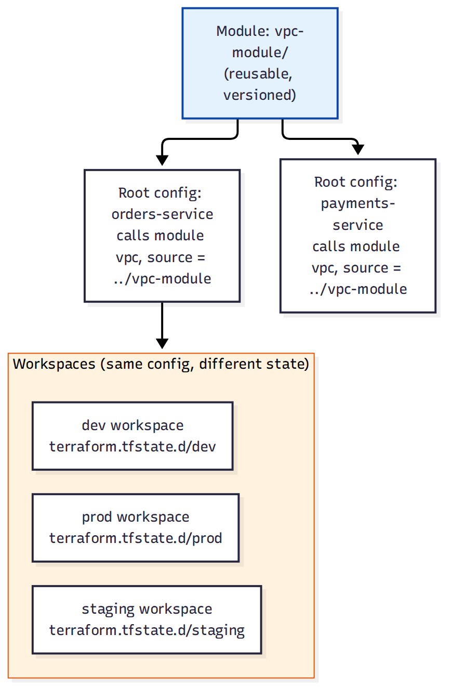

# 📚 Day 77 — Terraform Modules, Workspaces ও CloudFormation বনাম Terraform

> 📊 **Visual Summary** — সহজে বোঝার জন্য diagram:



**সময়:** ২ ঘণ্টা | **Module:** ১৩ (Infrastructure as Code) — Day 4

## 🎯 আজকের লক্ষ্য
- **Terraform Module**: reusable infrastructure component (Day 75-এর Nested Stack-এর সমতুল্য ধারণা)
- **Workspaces**: একই কোড, ভিন্ন environment (dev/staging/prod), ভিন্ন state
- `terraform import`: বিদ্যমান (manually তৈরি) resource-কে Terraform-এর আওতায় আনা
- **CloudFormation বনাম Terraform** — সম্পূর্ণ সিদ্ধান্ত গাইড
- Terraform-এর সীমাবদ্ধতা ও সতর্কতা

---

## Part 1: Terraform Module — Reusable Component

Day 75-এ CloudFormation Nested Stack দেখেছেন। Terraform-এ একই সমস্যার সমাধান **Module**।

```hcl
# modules/vpc-module/main.tf
variable "environment_name" {}

resource "aws_vpc" "this" {
  cidr_block = "10.0.0.0/16"
  tags = { Name = "vpc-${var.environment_name}" }
}

output "vpc_id" {
  value = aws_vpc.this.id
}
```

```hcl
# root config: orders-service/main.tf
module "vpc" {
  source           = "../modules/vpc-module"
  environment_name = "orders-dev"
}

resource "aws_security_group" "orders_sg" {
  vpc_id = module.vpc.vpc_id
}
```

**সুবিধা:** `vpc-module` একবার লিখে `orders-service`, `payments-service` — সব জায়গায় reuse করা যায় (Day 75-এর Nested Stack ধারণার মতোই, শুধু syntax ভিন্ন)। Module একটা **version** সহ Git repo বা Terraform Registry-তেও publish করা যায়।

---

## Part 2: Workspaces — একই কোড, ভিন্ন Environment

**সমস্যা:** dev, staging, prod-এর জন্য কি প্রতিটার আলাদা `.tf` ফাইল লিখতে হবে?

**সমাধান: Workspace** — একই কনফিগারেশন কোড, কিন্তু প্রতিটা workspace-এর **নিজস্ব state ফাইল**।

```bash
terraform workspace new dev
terraform workspace new staging
terraform workspace new prod

terraform workspace select dev
terraform apply   # শুধু dev-এর state আপডেট হয়

terraform workspace select prod
terraform apply   # আলাদা state, dev-কে প্রভাবিত করে না
```

```hcl
resource "aws_instance" "web" {
  instance_type = terraform.workspace == "prod" ? "m5.large" : "t3.micro"
}
```

> **সতর্কতা:** Workspace ছোট পার্থক্যের (instance size) জন্য ভালো, কিন্তু সম্পূর্ণ ভিন্ন architecture (dev-এ single AZ, prod-এ Multi-AZ + অনেক বেশি resource) হলে আলাদা root configuration/directory ভালো পছন্দ।

---

## Part 3: `terraform import` — বিদ্যমান Resource নিয়ে আসা

**সমস্যা:** একটা resource আগে console দিয়ে ম্যানুয়ালি তৈরি হয়েছিল, এখন সেটাকে Terraform-এ আনতে চান (Day 75-এর drift এড়াতে)।

```bash
terraform import aws_s3_bucket.orders_bucket shopbd-orders-prod
```

এটা resource-কে state ফাইলে যোগ করে, কিন্তু HCL কোড নিজে **লিখতে হয় ম্যানুয়ালি** (import শুধু state-এ আনে, কোড generate করে না, যদিও নতুন টুল যেমন `terraform plan -generate-config-out` কিছুটা সাহায্য করে)।

---

## Part 4: CloudFormation বনাম Terraform — সম্পূর্ণ সিদ্ধান্ত গাইড

| | **CloudFormation** | **Terraform** |
|---|---|---|
| Scope | শুধু AWS | Multi-cloud (AWS, GCP, Azure, SaaS) |
| State management | AWS নিজে করে (আপনাকে ভাবতে হয় না) | আপনাকে manage করতে হয় (remote backend) |
| Syntax | YAML/JSON (verbose) | HCL (তুলনামূলক পরিষ্কার) |
| নতুন AWS ফিচার সাপোর্ট | সাধারণত দ্রুত (AWS নিজেই বানায়) | কিছুটা দেরিতে (community/HashiCorp provider আপডেট লাগে) |
| Ecosystem | AWS-কেন্দ্রিক | বিশাল, multi-tool (Module 10-এর ECS বনাম EKS আলোচনার মতোই প্যাটার্ন) |
| Rollback | Automatic (Day 74) | Manual (state থেকে বোঝা লাগে কী ভুল হয়েছে) |

```
শুধু AWS ব্যবহার করেন, রোলব্যাক automatic চান, state নিয়ে ভাবতে চান না?  → CloudFormation
Multi-cloud/multi-tool (Kubernetes, Datadog ইত্যাদিও manage করতে চান)?  → Terraform
টিমের আগে থেকে Terraform অভিজ্ঞতা আছে?                                → Terraform (consistency-র জন্য)
AWS-এর একদম নতুন ফিচার সবার আগে ব্যবহার করতে চান?                     → CloudFormation (সাধারণত দ্রুত সাপোর্ট পায়)
```

> এই একই প্যাটার্ন Day 61 (ECS বনাম EKS)-এ দেখেছেন — AWS-native/সহজ বনাম multi-cloud/নমনীয়। সিদ্ধান্তটা প্রযুক্তিগত "কোনটা ভালো" না, বরং **আপনার প্রেক্ষাপট** (team skill, multi-cloud প্রয়োজন) অনুযায়ী।

---

## Part 5: Hands-on Lab

1. Day 76-এর `main.tf`-কে একটা module-এ রূপান্তর করুন (`modules/s3-bucket-module`)
2. Root configuration-এ সেই module দুইবার call করুন (দুইটা ভিন্ন bucket-এর জন্য)
3. `dev` আর `prod` workspace তৈরি করুন, দুটোতে আলাদাভাবে apply করে state আলাদা কিনা যাচাই করুন
4. একটা console দিয়ে ম্যানুয়ালি তৈরি S3 bucket `terraform import` দিয়ে আনুন
5. সব resource destroy করুন

---

## 🎯 আজকের মূল Takeaways
- Module = Terraform-এর Nested Stack সমতুল্য — reusable, versioned infrastructure component
- Workspace ছোট environment পার্থক্যের জন্য উপযুক্ত, বড় architectural পার্থক্যে আলাদা config ভালো
- `terraform import` বিদ্যমান resource-কে state-এ আনে, কিন্তু HCL কোড আলাদাভাবে লিখতে হয়
- CloudFormation বনাম Terraform সিদ্ধান্ত মূলত multi-cloud প্রয়োজন ও team skill-এর উপর নির্ভর করে, একটা "সবসময় ভালো" না

## 📝 Self-check Questions
1. Terraform Module আর CloudFormation Nested Stack-এর মধ্যে ধারণাগত মিল কী?
2. Workspace কখন যথেষ্ট, আর কখন আলাদা root configuration ভালো?
3. `terraform import` কী করে, আর কী করে না?
4. একটা টিম যদি AWS + Kubernetes + Datadog সবই manage করতে চায়, কোন IaC টুল বেশি উপযুক্ত?

## 💡 Pro Tips
- Module লেখার সময় খুব বেশি input variable দিয়ে over-engineer করবেন না, শুরুতে সরল রাখুন
- Workspace ব্যবহার করলে resource naming-এ `terraform.workspace` যোগ করুন, যাতে dev/prod resource ভুলে মিশে না যায়
- `terraform import` করার পরপরই `terraform plan` চালিয়ে নিশ্চিত করুন কোনো unexpected change দেখাচ্ছে না
- CloudFormation বনাম Terraform বিতর্কে ধর্মযুদ্ধ না করে টিমের বাস্তব প্রয়োজন (multi-cloud কিনা, existing skill) অনুযায়ী সিদ্ধান্ত নিন

## 🎨 Quick Reference
```
Module: reusable component (source = path/git/registry), CloudFormation Nested Stack-এর সমতুল্য
Workspace: same config, different state (dev/staging/prod) — ছোট পার্থক্যের জন্য
terraform import: existing resource → state (HCL কোড ম্যানুয়ালি লিখতে হয়)
CloudFormation: AWS-only, automatic state/rollback | Terraform: multi-cloud, manual state management
```

## 🚨 বাস্তব পরিস্থিতি (যেসব ভুল প্রায়ই হয়)

**পরিস্থিতি ১:** একটা টিম workspace দিয়ে dev/staging/prod আলাদা করেছিল, কিন্তু prod-এর architecture (Multi-AZ, বেশি resource) dev থেকে অনেক আলাদা ছিল — conditional logic এত জটিল হয়ে গেল যে কোড পড়াই কঠিন হয়ে গেল।
**শিক্ষা:** Architecture যথেষ্ট আলাদা হলে workspace-এর বদলে আলাদা root configuration ব্যবহার করুন।

**পরিস্থিতি ২:** "Terraform বেশি জনপ্রিয়" শুনে একটা ছোট, single-cloud (শুধু AWS) টিম CloudFormation ছেড়ে Terraform-এ migrate করল, কিন্তু state file management-এর বাড়তি জটিলতায় ছোট টিমের জন্য উল্টো বোঝা বেড়ে গেল।
**শিক্ষা:** টুল বাছাই জনপ্রিয়তা দিয়ে না, বাস্তব প্রয়োজন (multi-cloud কিনা) দিয়ে করুন।

---

**⏮ আগের দিন:** [Day 76 — Terraform Fundamentals](./Day-76-Terraform-Fundamentals-HCL-Provider-State.md) | **⏭ পরের দিন:** [Day 78 — Module 13 Revision + Project: IaC-ify করা ShopBD Platform](./Day-78-Module-13-Revision-IaC-ShopBD-Platform-Project.md)
