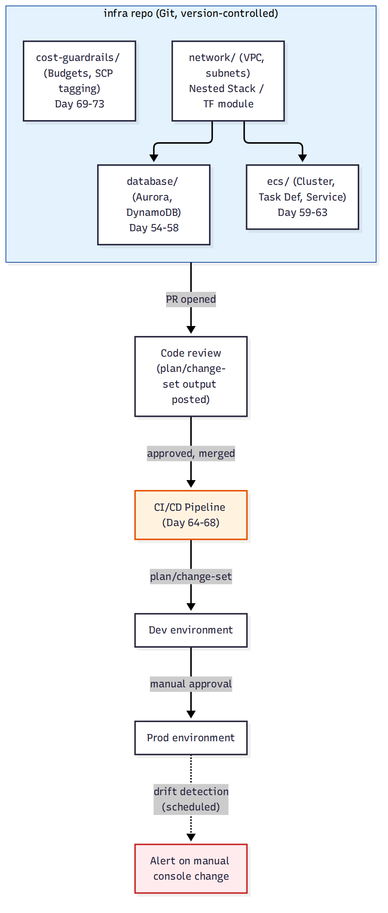

# 📚 Day 78 — Module 13 Revision + Project: IaC-ify করা ShopBD Platform

> 📊 **Visual Summary** — সহজে বোঝার জন্য diagram:



**সময়:** ২ ঘণ্টা | **Module:** ১৩ (Infrastructure as Code) — Day 5 (শেষ দিন)

## 🎯 আজকের লক্ষ্য
- পুরো Module 13 এক নজরে revision
- Project: Module 9-12-এ তৈরি হওয়া সম্পূর্ণ "ShopBD" প্ল্যাটফর্মকে IaC-তে রূপান্তর
- Production IaC checklist ও Final quiz
- **পুরো কোর্সের একটা সংক্ষিপ্ত সমাপ্তি** — Module 9 থেকে 13 কীভাবে একসাথে একটা বাস্তব প্রোডাকশন সিস্টেম তৈরি করে

---

# 🔁 Module 13 Revision

## 🗺 পুরো Module এক নজরে

| Day | বিষয় | এক লাইনে মনে রাখুন |
|---|---|---|
| 74 | CloudFormation Fundamentals | Resources একমাত্র বাধ্যতামূলক সেকশন; fail করলে automatic rollback |
| 75 | Nested Stacks, StackSets, Drift | Nested Stack = reusable অংশ; StackSet = multi-account deploy; Drift Detection = console পরিবর্তন ধরা |
| 76 | Terraform Fundamentals | HCL, cloud-agnostic; state ফাইল-ই কেন্দ্রীয় ধারণা, আপনাকে manage করতে হয় |
| 77 | Terraform Modules, Workspaces | Module = Nested Stack-এর সমতুল্য; Workspace = same code, different state |

## 🧭 সিদ্ধান্ত গাইড

```
শুধু AWS, automatic rollback/state management চান?        → CloudFormation
Multi-cloud বা multi-tool (K8s, Datadog ইত্যাদি) দরকার?    → Terraform
বড় infrastructure, পুনরায় ব্যবহারযোগ্য অংশে ভাগ করতে চান?  → Nested Stack (CFN) / Module (Terraform)
Organization-wide, সব account-এ একই baseline?              → StackSet (CFN) — Terraform-এ প্রতিটা account/workspace আলাদা apply
Environment-ভেদে ছোট পার্থক্য (size, count)?                → Parameters (CFN) / Workspace বা variable (Terraform)
কেউ console-এ ম্যানুয়ালি বদলেছে কিনা জানতে চান?             → Drift Detection (CFN) / `terraform plan` (উভয় টুলেই বোঝা যায়)
```

---

# 🛠 Project: "ShopBD" — সম্পূর্ণ Platform IaC-তে রূপান্তর

## প্রেক্ষাপট
এই মডিউল পর্যন্ত ShopBD-র জন্য তৈরি হয়েছে:
- **Module 9**: Aurora + DynamoDB ডেটাবেস
- **Module 10**: ECS/Fargate microservices (`api-gateway`, `orders-service`, `payments-service`)
- **Module 11**: CodePipeline + CodeBuild CI/CD
- **Module 12**: Cost visibility, budgets, purchasing options

এখন লক্ষ্য: এই **সবকিছু কোড হিসেবে** সংজ্ঞায়িত করা, যাতে পুরো প্ল্যাটফর্ম একটা কমান্ডে reproducible হয়।

## IaC Repository গঠন
```
shopbd-infra/
├── network/          # VPC, subnet, route table (Day 74-75-এর মতো nested stack, বা Terraform module)
├── database/         # Aurora cluster, DynamoDB table (Module 9)
├── ecs/              # Cluster, task definition, service, awsvpc SG (Module 10)
├── pipeline/          # CodePipeline, CodeBuild project (Module 11)
├── cost-guardrails/   # Budgets, SCP tagging enforcement (Module 12)
└── environments/
    ├── dev.tfvars (বা dev-parameters.json)
    ├── staging.tfvars
    └── prod.tfvars
```

## ধাপে ধাপে সিদ্ধান্ত

### ১. Network ও Database (Day 74–77)
- `network` module/nested stack একবার লিখে dev/staging/prod তিনটাতেই reuse
- `database` module-এ Aurora/DynamoDB config, Environment parameter দিয়ে dev-এ ছোট (single instance), prod-এ Multi-AZ

### ২. ECS ও Pipeline (Module 10-11-এর কোড হিসেবে প্রকাশ)
- Task Definition, Service, Security Group — সব IaC-তে (Day 60, 62)
- CodePipeline নিজেও IaC-তে (Day 67-এর Pipeline-as-Code নীতি) — pipeline-এর পরিবর্তনও PR review-এর মধ্য দিয়ে যায়

### ৩. Cost Guardrails IaC হিসেবে (Module 12-এর সাথে সংযোগ)
- Budget, SCP tagging enforcement (Day 52, Day 73) — StackSet (CloudFormation) দিয়ে সব account-এ একসাথে deploy

### ৪. Environment-ভেদে পার্থক্য
```
Dev:     Single-AZ Aurora, ২টা ECS task, ছোট instance size
Staging: Dev-এর মতোই কিন্তু production data-র subset দিয়ে টেস্ট
Prod:    Multi-AZ Aurora + Read Replica, Auto Scaling (2-10 task), Reserved Instance/Savings Plans কভারেজ
```
CloudFormation-এ `Parameters` + `Mappings`, বা Terraform-এ `variables` + `workspaces`/`tfvars` দিয়ে এই পার্থক্য express করা হয়।

### ৫. Drift Detection ও Governance (Day 75, Day 52-এর সাথে সংযোগ)
- একটা scheduled job (EventBridge + Lambda, Day 31) নিয়মিত Drift Detection চালায়, কোনো drift পেলে alert পাঠায়
- Terraform ব্যবহার করলে CI pipeline-এ নিয়মিত `terraform plan` চালিয়ে unexpected diff চেক করা যায়

## ✅ Production IaC Checklist
- [ ] প্রতিটা resource IaC-তে সংজ্ঞায়িত, কোনো "console-only" resource নেই
- [ ] বড় template/config module/nested stack-এ ভাগ করা, reusable
- [ ] Stateful resource-এ DeletionPolicy/lifecycle protection (Day 75)
- [ ] Environment-ভেদে পার্থক্য parameters/variables দিয়ে express করা, কোড ডুপ্লিকেট না করে
- [ ] Remote state (Terraform হলে) S3 + DynamoDB locking দিয়ে সুরক্ষিত
- [ ] IaC পরিবর্তন PR review-এর মধ্য দিয়ে যায়, সরাসরি apply না
- [ ] Production apply-এর আগে plan/change-set preview বাধ্যতামূলক
- [ ] Organization-wide baseline (budget, SCP) StackSets/সমতুল্য দিয়ে সব account-এ consistent
- [ ] নিয়মিত Drift Detection/plan diff চেক, কেউ console-এ সরাসরি বদলায়নি নিশ্চিত করা

---

## 📝 Module 13 Final Quiz

1. CloudFormation-এ state আর Terraform-এ state manage করার দায়িত্ব কার?
2. Nested Stack আর Terraform Module-এর ধারণাগত মিল কী?
3. StackSet-এর Terraform-এ প্রায় কাছাকাছি সমতুল্য কী (যদিও হুবহু এক না)?
4. Environment-ভেদে (dev/prod) ছোট পার্থক্যের জন্য CloudFormation আর Terraform-এ কী ব্যবহার হয়?

### 🎓 Exam-ধাঁচের প্রশ্ন

**Q5.** A company wants to deploy the same baseline CloudTrail and Config Rules setup to every AWS account in their organization automatically, including newly created accounts. Which CloudFormation feature should they use?
- A. Nested Stacks
- B. Change Sets
- C. StackSets integrated with AWS Organizations
- D. Drift Detection

**Q6.** A team using Terraform notices that a security group was modified directly in the AWS console, bypassing their IaC workflow. What is the correct next step before making further Terraform changes?
- A. Run `terraform destroy` and recreate everything
- B. Run `terraform plan` to see the detected difference, then decide whether to update the code or revert the manual change
- C. Ignore it since Terraform will automatically fix it silently
- D. Delete the terraform.tfstate file

<details><summary>▶ উত্তর দেখুন</summary>

1. CloudFormation-এ AWS নিজে state manage করে (আপনাকে ভাবতে হয় না); Terraform-এ আপনাকে নিজে state ফাইল (সাধারণত remote backend-এ) manage করতে হয়।
2. দুটোই বড় infrastructure-কে ছোট, reusable, independently-testable অংশে ভাগ করার উপায় — একটা "parent" config অন্য "child" config-কে reference করে।
3. Terraform-এ প্রতিটা account/environment-এ আলাদাভাবে (workspace বা আলাদা root config দিয়ে) apply চালাতে হয় — StackSet-এর মতো "এক কমান্ডে সব account"-এর native ফিচার নেই, তবে CI/CD দিয়ে loop করে কাছাকাছি achieve করা যায়।
4. CloudFormation-এ `Parameters`/`Mappings`; Terraform-এ `variables` + `workspaces` বা environment-ভিত্তিক `.tfvars` ফাইল।
5. **C**: StackSets, AWS Organizations-এর সাথে integrate করলে নতুন account তৈরি হলেও automatically baseline apply হয়।
6. **B**: প্রথমে `terraform plan` চালিয়ে ঠিক কী পার্থক্য (drift) তৈরি হয়েছে বুঝুন, তারপর সিদ্ধান্ত নিন কোড আপডেট করবেন নাকি ম্যানুয়াল পরিবর্তন revert করবেন — destroy বা state ফাইল ডিলিট করা ভুল ও বিপজ্জনক পদক্ষেপ।
</details>

---

## 💡 Pro Tips

- IaC-কে "একবার লিখে ভুলে যাওয়ার" জিনিস ভাববেন না — কোডের মতোই এটাও maintain, review, ও টেস্ট করতে হয়
- ছোট শুরু করুন: একটা অংশ (যেমন শুধু network) দিয়ে IaC শুরু করুন, তারপর ধীরে ধীরে পুরো platform কভার করুন
- Module 8 (security)-এর নীতি IaC repo-তেও প্রযোজ্য — IaC pipeline-এর নিজস্ব IAM role least-privilege হওয়া উচিত
- CloudFormation বনাম Terraform বেছে নেওয়ার পর মাঝপথে বদলাবেন না, দুটো টুল মিশিয়ে maintain করা জটিলতা বাড়ায়

---

## 🚨 বাস্তব পরিস্থিতি (যেসব ভুল প্রায়ই হয়)

**পরিস্থিতি ১:** একটা টিম অর্ধেক infrastructure IaC-তে, বাকি অর্ধেক console-এ ম্যানুয়ালি বানিয়েছিল — কোনটা কোথায় আছে ট্র্যাক করা প্রায় অসম্ভব হয়ে গেল।
**শিক্ষা:** ধীরে হলেও পুরো infrastructure-কে IaC-র আওতায় আনার লক্ষ্য রাখুন, আংশিক adoption দীর্ঘমেয়াদে আরও বিভ্রান্তিকর।

**পরিস্থিতি ২:** কোনো code review ছাড়াই যে কেউ সরাসরি `terraform apply`/CloudFormation deploy চালাতে পারত — একটা ভুল commit প্রোডাকশনে বড় resource ডিলিট করে ফেলল।
**শিক্ষা:** IaC পরিবর্তনও সাধারণ কোডের মতোই PR review ও CI/CD gate-এর মধ্য দিয়ে যাওয়া উচিত (Module 11-এর নীতি)।

---

**⏮ আগের দিন:** [Day 77 — Terraform Modules, Workspaces](./Day-77-Terraform-Modules-Workspaces-CloudFormation-vs-Terraform.md) | **⏭ পরের:** [99 — Interview Q&A](../99-Interview-QA/01-Questions.md) অথবা [98 — SAA-C03 Exam Prep](../98-SAA-C03-Exam-Prep/01-Exam-Overview-and-Strategy.md)
