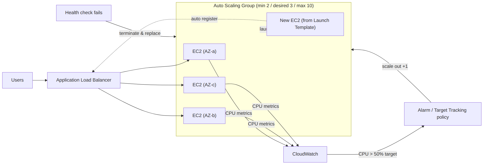
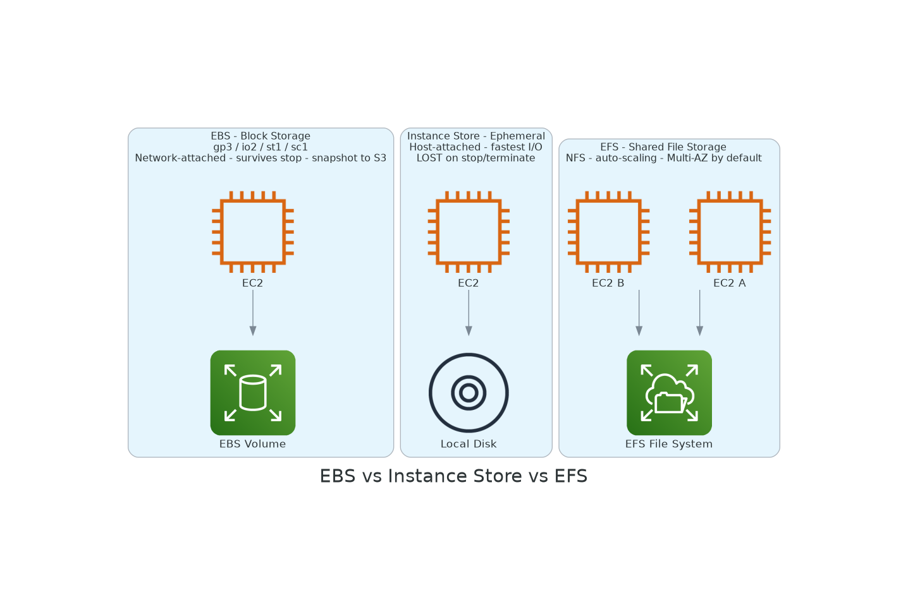

# 🗂 Module 1 Cheat Sheet — EC2 & Storage Fundamentals

> **এক পাতায় পুরো module।** Interview/exam-এর আগের রাতে শুধু এই পাতাটা দেখুন — বিস্তারিত লাগলে Day 1–7-এর লিংকে যান।

📚 বিস্তারিত নোট: [Day 1](../02-Module-1-EC2-and-Storage/Day-01-Cloud-Computing-AWS-Infrastructure-Account-Setup.md) → [Day 7](../02-Module-1-EC2-and-Storage/Day-07-Auto-Scaling-Module-1-Revision.md)

---

## 🖼 Visual Summary





---

## ⚡ Service at a Glance

| Service | কী | মূল সংখ্যা | কখন ব্যবহার |
|---|---|---|---|
| **EC2** | Virtual server | t/m/c/r/i family | যেকোনো compute দরকারে |
| **AMI** | EC2-এর template (OS+software) | — | Custom golden image বানাতে |
| **EBS** | Network-attached block storage | gp3 (default), io2 (high IOPS), st1/sc1 (HDD) | Root/data volume, single instance |
| **Instance Store** | Host-attached ephemeral disk | stop/terminate হলে data হারায় | Cache, temp data, fastest I/O |
| **EFS** | Shared NFS file system | Multi-AZ by default | একাধিক EC2 একই file share করলে |
| **S3** | Object storage | 0 বাইট – 5TB/object | যেকোনো ফাইল/backup/static site |
| **Auto Scaling Group** | EC2-র সংখ্যা automatic control | min/desired/max | Traffic অনুযায়ী scale in/out |

---

## 💰 Pricing Models — এক নজরে

| Model | ছাড় | Commitment | Interruption ঝুঁকি |
|---|---|---|---|
| On-Demand | নেই (সবচেয়ে দামি) | নেই | নেই |
| Reserved / Savings Plans | ৭২% পর্যন্ত | ১-৩ বছর | নেই |
| Spot | ৯০% পর্যন্ত | নেই | ২ মিনিট নোটিসে বন্ধ হতে পারে |
| Dedicated Host/Instance | সবচেয়ে দামি | — | Compliance/BYOL-এর জন্য |

---

## 🗄 S3 Storage Class Lifecycle

```
Standard (hot, ms) → 30d → Standard-IA → 90d → Glacier Instant
   → 180d → Glacier Flexible (min-12h) → 365d → Glacier Deep Archive (12-48h)
```
Access pattern অনিশ্চিত হলে → **Intelligent-Tiering** (auto move করে দেয়)।

---

## 🔒 Security Group vs Network ACL

| | Security Group | Network ACL |
|---|---|---|
| Level | Instance | Subnet |
| State | Stateful (return traffic auto-allow) | Stateless (দুই দিকেই rule লাগে) |
| Rule type | Allow only | Allow + Deny |
| Evaluation | সব rule check হয় | Rule number অনুযায়ী প্রথম match |

---

## 💻 Practical Commands (Day 1–7 থেকে)

```bash
# Key file permission ঠিক করা (না করলে SSH refuse করবে)
chmod 400 my-aws-key.pem

# SSH দিয়ে EC2-তে connect
ssh -i my-aws-key.pem ec2-user@<instance-public-ip>

# Instance-এর ভেতর থেকে network info
ip addr            # private IP
curl ifconfig.me   # public IP
```

---

## ⚠️ Top Gotchas

1. **Instance Store ≠ persistent** — stop/terminate করলে DATA হারিয়ে যায়, EBS নয়।
2. **Security Group-এ Deny rule নেই** — block করতে হলে NACL বা WAF লাগবে।
3. **gp2 legacy, gp3 default** — নতুন volume-এ gp3 ব্যবহার করুন (cheaper, IOPS আলাদা কনফিগারযোগ্য)।
4. **Spot Instance** ইন্টারাপশন handle করার জন্য app stateless/checkpoint-friendly হতে হবে।
5. **Auto Scaling health check**: ELB health check ব্যবহার না করলে ASG শুধু EC2 status check করবে, app-level সমস্যা ধরবে না।

---

## 🔢 মনে রাখার সংখ্যা

- EBS volume max size: **64 TiB** (io2 Block Express)
- S3 object max size: **5 TB**
- S3 single PUT max: **5 GB** (এর বেশি হলে multipart upload)
- Spot interruption notice: **2 মিনিট**
- EC2 key pair: ***.pem** (Linux) / **.ppk** (PuTTY, Windows)

---

**⏮ পূর্ববর্তী:** [SAA-C03 Exam Prep](../98-SAA-C03-Exam-Prep/) | **⏭ পরবর্তী:** [Module 2 Cheat Sheet](./02-Module-2-VPC-Networking-Cheat-Sheet.md)
