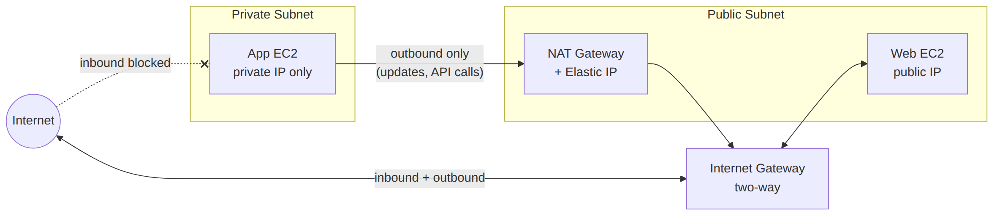

# 🗂 Module 2 Cheat Sheet — VPC Design & Network Architecture

> **এক পাতায় পুরো module।** বিস্তারিত লাগলে Day 8–14-এ যান।

📚 বিস্তারিত নোট: [Day 8](../03-Module-2-VPC-and-Networking/Day-08-VPC-Core-Components-CIDR.md) → [Day 14](../03-Module-2-VPC-and-Networking/Day-14-Network-Design-Patterns-Module-2-Revision.md)

---

## 🖼 Visual Summary




---

## ⚡ Service at a Glance

| Concept | কী | মূল পয়েন্ট |
|---|---|---|
| **VPC** | নিজস্ব isolated network | CIDR block (e.g. 10.0.0.0/16) |
| **Subnet** | VPC-এর ভাগ, একটা AZ-এ থাকে | Public (IGW route আছে) vs Private |
| **Internet Gateway** | VPC ↔ Internet | Public subnet-এর route table-এ থাকে |
| **NAT Gateway** | Private subnet → Internet (outbound only) | Public subnet-এ বসে, per-AZ HA |
| **Route Table** | Traffic কোন পথে যাবে ঠিক করে | Subnet-এর সাথে associate করা লাগে |
| **VPC Endpoint** | AWS service-এ private access | Gateway (S3/DynamoDB, free) vs Interface (ENI, paid) |
| **NACL** | Subnet-level firewall | Stateless, allow+deny |

---

## 🌐 IGW vs NAT Gateway

| | Internet Gateway | NAT Gateway |
|---|---|---|
| দিক | Bidirectional | Outbound only (private → internet) |
| থাকে কোথায় | VPC-level attach | Public subnet-এ বসানো |
| খরচ | Free | ঘণ্টা + data processing চার্জ |
| ব্যবহার | Public subnet-এর instance-কে internet access | Private subnet-এর instance-এর update/patch download |

---

## 💻 Practical Commands

```bash
# Region সেট করা
aws configure set region ap-south-1

# S3 bucket list (VPC endpoint টেস্ট করতে)
aws s3 ls

# SSM দিয়ে bastion ছাড়াই private instance-এ connect
aws ssm start-session --target i-1234567890abcdef0
```

---

## ⚠️ Top Gotchas

1. **NAT Gateway public subnet-এ বসে**, private subnet-এ নয় — এই ভুলটা সবচেয়ে বেশি হয়।
2. **Zone apex (example.com)-এ CNAME দেওয়া যায় না** — Route 53-এ Alias record লাগবে (Module 7-তে বিস্তারিত)।
3. **NACL stateless** — ইনবাউন্ড allow করলেই আউটবাউন্ড ephemeral port (1024-65535) আলাদা allow করতে হয়।
4. **Gateway Endpoint শুধু S3/DynamoDB-এর জন্য**, বাকি সব service-এর জন্য Interface Endpoint লাগবে (paid)।
5. এক VPC-এর দুই subnet ভিন্ন AZ-এ থাকলেও **route table override না করলে** একই route table ব্যবহার করে — explicit association ভুলে গেলে bug হয়।

---

## 🔢 মনে রাখার সংখ্যা

- VPC CIDR: **/16 থেকে /28** পর্যন্ত সাপোর্ট করে
- প্রতি VPC-তে **৫টা IP reserved** থাকে প্রতি subnet-এ (network, broadcast, DNS, future use × 2)
- Default VPC limit: **৫টা per region** (increase করা যায়)

---

**⏮ পূর্ববর্তী:** [Module 1 Cheat Sheet](./01-Module-1-EC2-Storage-Cheat-Sheet.md) | **⏭ পরবর্তী:** [Module 3 Cheat Sheet](./03-Module-3-App-Deployment-Cheat-Sheet.md)
