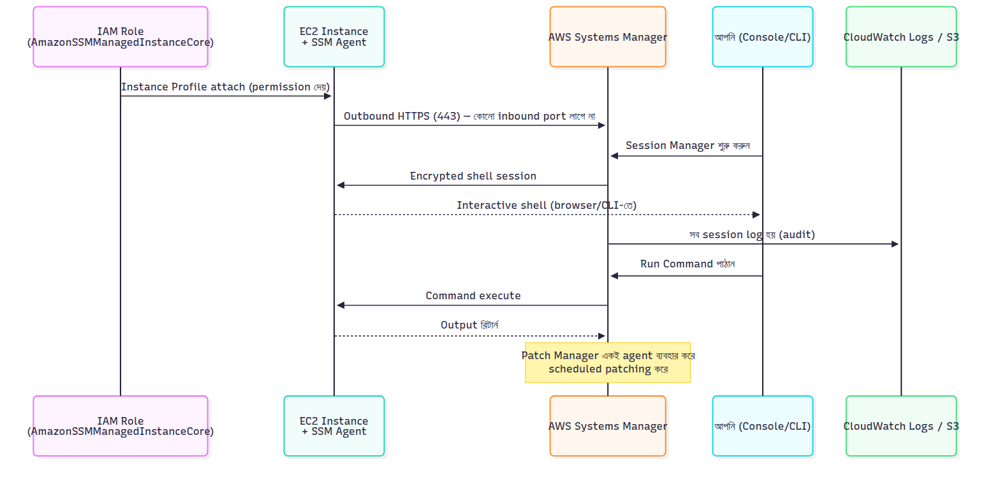

# 🗂 Module 3 Cheat Sheet — Application Deployment on EC2 with systemd

> **এক পাতায় পুরো module।** বিস্তারিত লাগলে Day 15–21-এ যান।

📚 বিস্তারিত নোট: [Day 15](../04-Module-3-Application-Deployment/Day-15-User-Data-Cloud-init-EC2-Instance-Connect.md) → [Day 21](../04-Module-3-Application-Deployment/Day-21-CICD-CodeDeploy-GitHub-Actions-Module-3-Revision.md)

---

## 🖼 Visual Summary





---

## ⚡ Service at a Glance

| Concept | কী | মূল পয়েন্ট |
|---|---|---|
| **User Data** | Boot-এ একবার চলা script | cloud-init দিয়ে execute হয় |
| **SSM Session Manager** | Browser/CLI shell, কোনো SSH port লাগে না | IAM Instance Profile লাগবে |
| **systemd** | Linux service manager | `systemctl start/enable/status` |
| **Nginx** | Reverse proxy | App-কে port 80/443-এ expose করে |
| **PM2** | Node.js process manager | Auto-restart, log management |
| **CodeDeploy** | EC2/on-prem-এ automated deploy | `appspec.yml` দিয়ে lifecycle hook |

---

## 💻 Practical Commands

```bash
# systemd service management
sudo systemctl start myapp
sudo systemctl enable myapp   # boot-এ auto start
sudo systemctl status myapp

# EC2 tag আপডেট
aws ec2 create-tags --resources i-xxxx --tags Key=Env,Value=prod

# S3 থেকে deployment package আনা
aws s3 cp s3://bucket/app.zip .

# EC2 Instance Connect দিয়ে temporary SSH key push
aws ec2-instance-connect send-ssh-public-key --instance-id i-xxx

# CodeDeploy দিয়ে নতুন deployment শুরু
aws deploy create-deployment --application-name myapp \
  --deployment-group-name prod-group --s3-location bucket=my-bucket,key=app.zip,bundleType=zip

# CloudWatch custom alarm
aws cloudwatch put-metric-alarm --alarm-name high-cpu --metric-name CPUUtilization ...
```

---

## ⚠️ Top Gotchas

1. **User Data শুধু প্রথম boot-এ চলে** (default) — reboot-এ আবার চলে না, চাইলে cloud-init config দিয়ে বদলাতে হয়।
2. **`ExecStartPre` root privilege লাগলে `+` prefix লাগবে** — নাহলে `User=` directive-এর কারণে permission fail করবে।
3. **SSM Agent-এর জন্য IAM Instance Profile লাগবে** (`AmazonSSMManagedInstanceCore`), নাহলে console-এ instance দেখা যাবে না।
4. **PM2 দিয়ে চালানো app সার্ভার reboot হলে বন্ধ হয়ে যায়**, যদি না `pm2 startup` + `pm2 save` করা থাকে।
5. **CodeDeploy-এর `appspec.yml` ভুল থাকলে deployment silently fail করে** — লগ CloudWatch/CodeDeploy console-এ চেক করুন।

---

## 🔢 মনে রাখার সংখ্যা

- systemd service file: `/etc/systemd/system/*.service`
- SSM Session log destination: CloudWatch Logs / S3
- Nginx default config: `/etc/nginx/sites-available/`

---

**⏮ পূর্ববর্তী:** [Module 2 Cheat Sheet](./02-Module-2-VPC-Networking-Cheat-Sheet.md) | **⏭ পরবর্তী:** [Module 4 Cheat Sheet](./04-Module-4-Serverless-Lambda-Cheat-Sheet.md)
