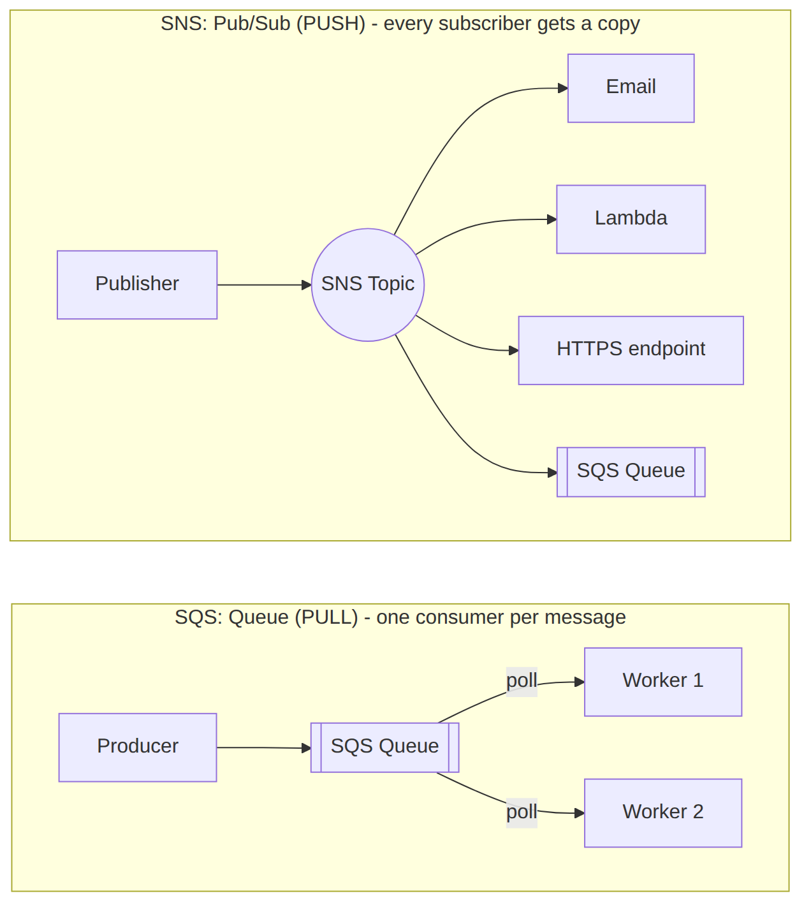
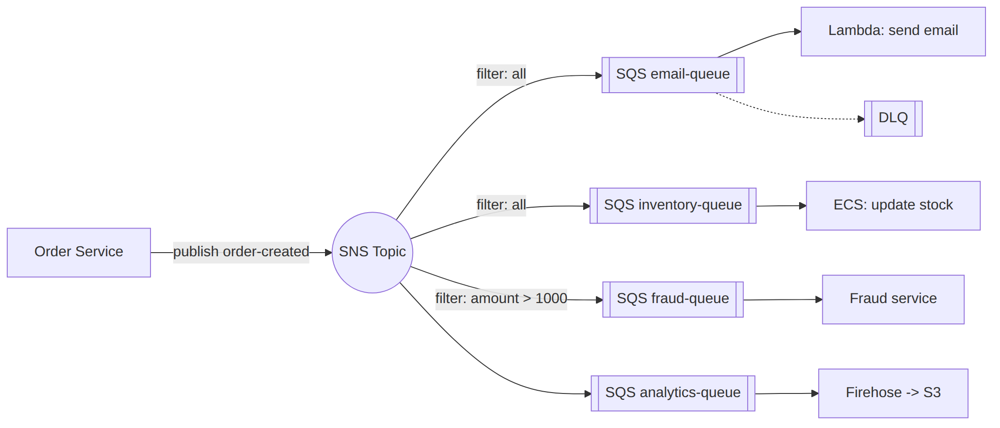
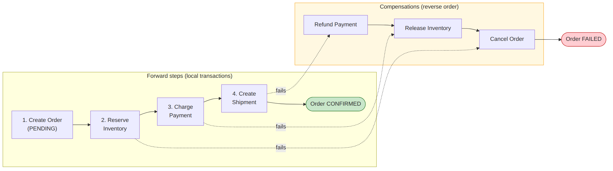

# 🗂 Module 5 Cheat Sheet — Event-Driven Architectures with Lambda

> **এক পাতায় পুরো module।** বিস্তারিত লাগলে Day 29–35-এ যান।

📚 বিস্তারিত নোট: [Day 29](../06-Module-5-Event-Driven-Architectures/Day-29-SQS-Deep-Dive-Standard-FIFO-DLQ.md) → [Day 35](../06-Module-5-Event-Driven-Architectures/Day-35-Module-5-Revision-Event-Driven-Order-System.md)

---

## 🖼 Visual Summary







---

## ⚡ Service at a Glance

| Service | কী | মূল পয়েন্ট |
|---|---|---|
| **SQS Standard** | Pull-based queue | At-least-once, ordering নেই, unlimited throughput |
| **SQS FIFO** | Ordered queue | Exactly-once, ৩০০-৩০০০ msg/sec |
| **SNS** | Pub-sub | এক message → অনেক subscriber (fan-out) |
| **EventBridge** | Event bus + rules | SaaS integration, schema registry, pattern matching |
| **Step Functions** | Workflow orchestration | Standard (durable, দীর্ঘ) vs Express (high-volume, দ্রুত) |
| **DLQ** | ব্যর্থ message-এর গন্তব্য | maxReceiveCount পার হলে move হয় |

---

## 🔀 SQS vs SNS vs EventBridge

| | SQS | SNS | EventBridge |
|---|---|---|---|
| Model | Queue (pull) | Pub-sub (push) | Event bus + rules |
| Consumer | একটাই (message delete হয়) | অনেক subscriber | Pattern-matched অনেক target |
| Use case | Decoupling, buffer | Fan-out notification | SaaS/cross-account event routing |

---

## 💻 Practical Commands

```bash
# SNS topic তৈরি ও publish
aws sns create-topic --name order-events
aws sns publish --topic-arn arn:aws:sns:...:order-events --message "New order"

# EventBridge custom bus ও event পাঠানো
aws events create-event-bus --name orders-bus
aws events put-events --entries file://events.json

# Event pattern টেস্ট করা (deploy করার আগে)
aws events test-event-pattern --event-pattern file://pattern.json --event file://event.json

# Scheduled job (EventBridge Scheduler)
aws scheduler create-schedule --name daily-cleanup --schedule-expression "rate(1 day)" ...
```

---

## ⚠️ Top Gotchas

1. **SQS Standard-এ order/exactly-once গ্যারান্টি নেই** — লাগলে FIFO ব্যবহার করুন (throughput কম)।
2. **Visibility timeout কম হলে duplicate processing হয়** — consumer-এর processing time-এর চেয়ে বেশি রাখুন।
3. **SNS message ordering শুধু FIFO topic-এ** (standard SNS-এ order গ্যারান্টি নেই)।
4. **Saga pattern-এ compensation logic ভুলে গেলে** partial failure-এ data inconsistent থেকে যায়।
5. **EventBridge rule pattern ভুল লিখলে silently কোনো event match করে না** — deploy-এর আগে সবসময় `test-event-pattern` দিয়ে যাচাই করুন।

---

## 🔢 মনে রাখার সংখ্যা

- SQS message max size: **256 KB**
- SQS max retention: **14 দিন**
- SQS visibility timeout max: **12 ঘণ্টা**
- Step Functions Express max duration: **5 মিনিট**
- SNS max subscribers per topic: **12.5 million**

---

**⏮ পূর্ববর্তী:** [Module 4 Cheat Sheet](./04-Module-4-Serverless-Lambda-Cheat-Sheet.md) | **⏭ পরবর্তী:** [Module 6 Cheat Sheet](./06-Module-6-Multi-VPC-Cheat-Sheet.md)
