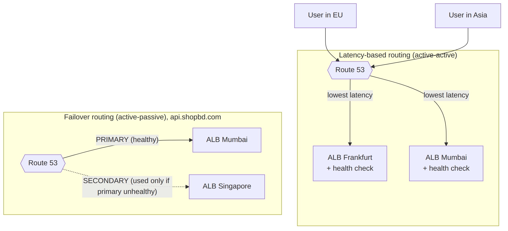

# 🗂 Module 7 Cheat Sheet — Edge Services, DNS & Load Balancing

> **এক পাতায় পুরো module।** বিস্তারিত লাগলে Day 43–48-এ যান।

📚 বিস্তারিত নোট: [Day 43](../08-Module-7-Edge-DNS-Load-Balancing/Day-43-CloudFront-Basics-Distributions-Origins.md) → [Day 48](../08-Module-7-Edge-DNS-Load-Balancing/Day-48-Global-Accelerator-Module-7-Revision.md)

---

## 🖼 Visual Summary




---

## ⚡ Service at a Glance

| Service | কী | মূল পয়েন্ট |
|---|---|---|
| **CloudFront** | CDN, edge caching | Origin: S3/ALB/Custom; ACM cert **শুধু us-east-1** |
| **Route 53** | DNS + health check + routing policy | Simple/Weighted/Latency/Failover/Geolocation |
| **ALB** | L7 (HTTP/HTTPS) load balancer | Path/host-based routing, target group |
| **NLB** | L4 (TCP/UDP) load balancer | Static IP, extreme throughput |
| **GWLB** | L3 firewall appliance insertion | Third-party security appliance chaining |
| **Global Accelerator** | Anycast IP, TCP/UDP acceleration | Static IP, CloudFront cache করে না |

---

## 🔀 ALB vs NLB vs GWLB

| | ALB | NLB | GWLB |
|---|---|---|---|
| Layer | L7 | L4 | L3 (GENEVE) |
| Use case | HTTP routing, microservices | Extreme performance, static IP দরকার | Firewall/IDS appliance-এর মধ্য দিয়ে traffic route |
| Target | EC2, Lambda, IP, containers | EC2, IP | Appliance fleet |

---

## 💻 Practical Commands

```bash
# CloudFront cache invalidate করা (নতুন deploy-এর পর)
aws cloudfront create-invalidation --distribution-id EXXXXX --paths "/*"

# ALB target group attribute বদলানো (deregistration delay ইত্যাদি)
aws elbv2 modify-target-group-attributes --target-group-arn arn:aws:elasticloadbalancing:... \
  --attributes Key=deregistration_delay.timeout_seconds,Value=30
```

---

## ⚠️ Top Gotchas

1. **CloudFront-এর জন্য ACM certificate শুধু `us-east-1`-এ বানাতে হয়**, region যাই হোক না কেন।
2. **Zone apex (example.com)-এ CNAME দেওয়া যায় না** — Alias record ব্যবহার করুন (ALB/CloudFront-এর জন্যও)।
3. **NLB health check fail হলে পুরো AZ-এর target বাদ পড়ে যেতে পারে** — cross-zone load balancing মাথায় রাখুন।
4. **CloudFront cache invalidate করলেও propagate হতে কিছুক্ষণ সময় লাগে** — instant নয়।
5. **Global Accelerator cache করে না** — এটা routing/failover accelerate করে, static content-এর জন্য CloudFront দরকার।

---

## 🔢 মনে রাখার সংখ্যা

- CloudFront edge location: **৪০০+ বিশ্বজুড়ে**
- Route 53 health check interval: **10 বা 30 সেকেন্ড**
- ALB idle timeout default: **60 সেকেন্ড**
- Global Accelerator: **2টা static Anycast IP**

---

**⏮ পূর্ববর্তী:** [Module 6 Cheat Sheet](./06-Module-6-Multi-VPC-Cheat-Sheet.md) | **⏭ পরবর্তী:** [Module 8 Cheat Sheet](./08-Module-8-Network-Security-Cheat-Sheet.md)
