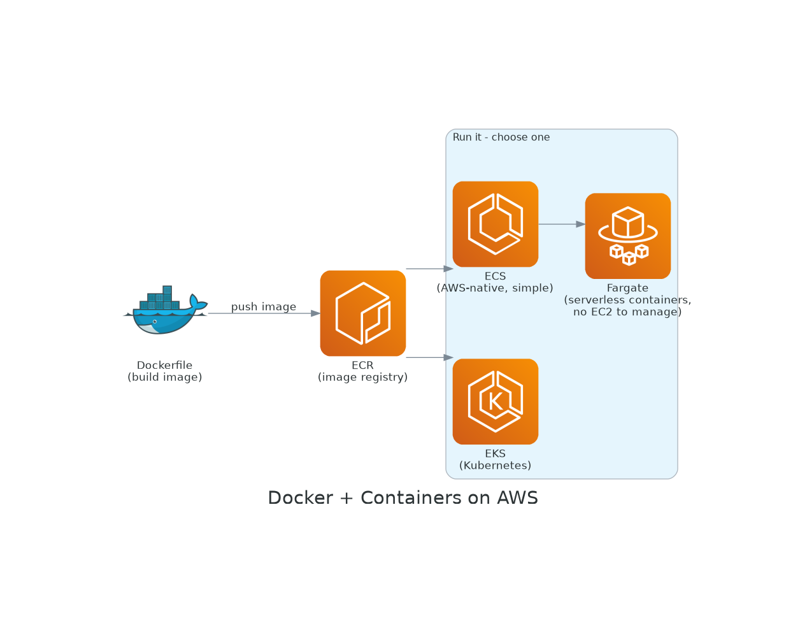
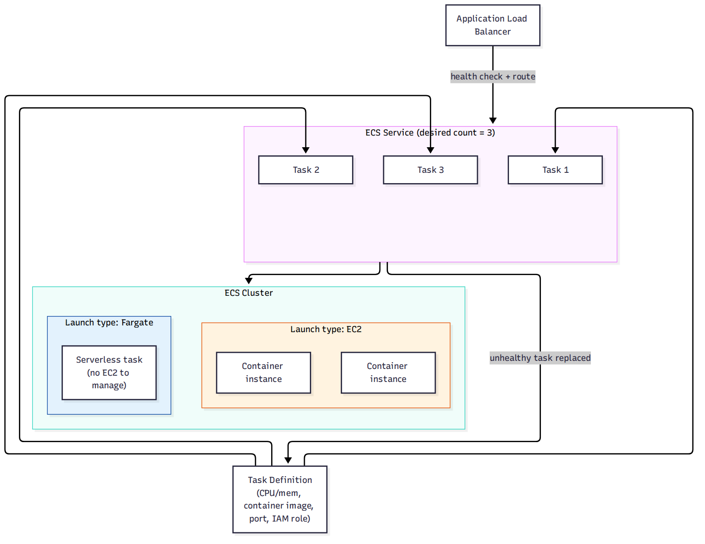

# 🗂 Module 10 Cheat Sheet — Containers: ECS, EKS & Fargate

> **এক পাতায় পুরো module।** বিস্তারিত লাগলে Day 59–63-এ যান।

📚 বিস্তারিত নোট: [11-Module-10-Containers-ECS-EKS-Fargate](../11-Module-10-Containers-ECS-EKS-Fargate/)

---

## 🖼 Visual Summary






---

## ⚡ Service at a Glance

| Service | কী | মূল পয়েন্ট |
|---|---|---|
| **ECR** | Container image registry | Docker image push/pull |
| **ECS** | AWS-native orchestration | Cluster → Service → Task |
| **EKS** | Managed Kubernetes | Kubernetes API, বেশি flexibility, বেশি জটিলতা |
| **Fargate** | Serverless container launch | ECS/EKS-এর সাথে, EC2 manage করতে হয় না |

---

## 🔀 ECS vs EKS vs Fargate

| | ECS | EKS | Fargate |
|---|---|---|---|
| Complexity | কম | বেশি (K8s knowledge লাগে) | Launch type, complexity না |
| Best for | AWS-native, simple | Multi-cloud/portable, existing K8s workflow | EC2 manage করতে না চাইলে |

---

## 💻 Practical Commands

```bash
# ECR login ও image push
aws ecr get-login-password --region ap-south-1 | docker login --username AWS --password-stdin <account>.dkr.ecr.ap-south-1.amazonaws.com
docker build -t myapp .
docker tag myapp:latest <account>.dkr.ecr.ap-south-1.amazonaws.com/myapp:latest
docker push <account>.dkr.ecr.ap-south-1.amazonaws.com/myapp:latest
```

---

## ⚠️ Top Gotchas

1. **Fargate = launch type, orchestrator নয়** — ECS বা EKS-এর সাথেই ব্যবহার হয়, আলাদা কিছু নয়।
2. **ECS Task Definition-এ CPU/Memory ভুল combination দিলে task launch হবে না** — Fargate-এর নির্দিষ্ট valid combination আছে।
3. **EKS-এর জন্য আলাদা control plane খরচ আছে** (ECS-এ নেই) — ছোট workload-এ EKS বেশি খরচ হতে পারে।
4. **Container image-এ secret hardcode করা** — Secrets Manager/Parameter Store ব্যবহার করুন, ECR image-এ নয়।
5. **awsvpc network mode-এ প্রতিটা task-এর নিজস্ব ENI লাগে** — subnet-এর IP ফুরিয়ে যেতে পারে বড় scale-এ।

---

## 🔢 মনে রাখার সংখ্যা

- ECS launch type: **EC2 বা Fargate**
- Fargate task max: **4 vCPU, 30 GB memory** (এর বেশি দরকার হলে EC2 launch type)
- ECR image push: **docker push** standard workflow

---

**⏮ পূর্ববর্তী:** [Module 9 Cheat Sheet](./09-Module-9-Databases-Cheat-Sheet.md) | **⏭ পরবর্তী:** [Module 11 Cheat Sheet](./11-Module-11-CICD-Cheat-Sheet.md)
