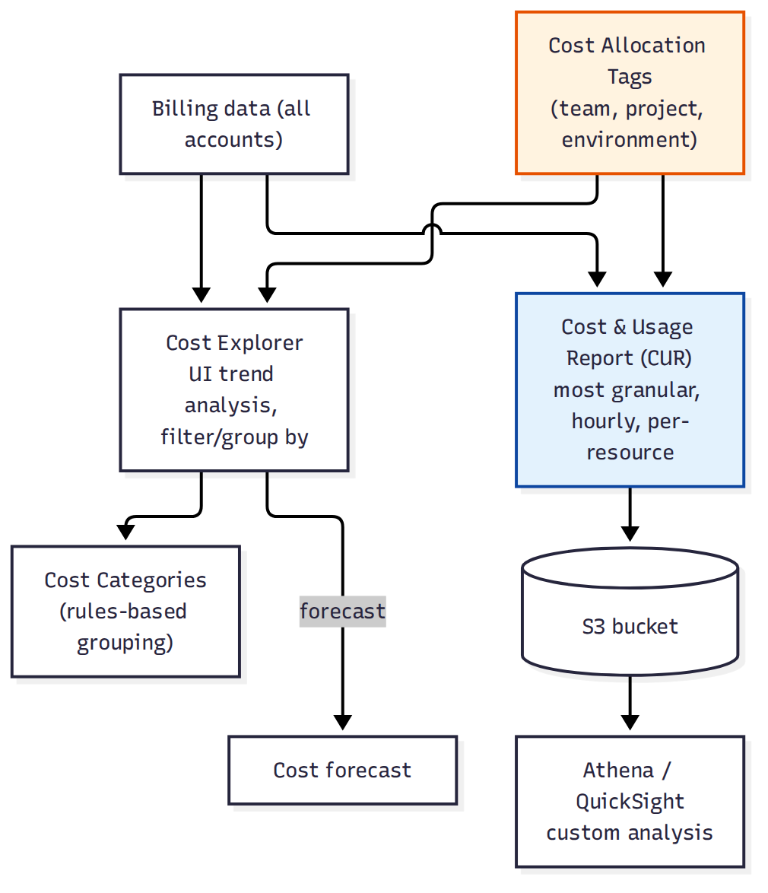

# 🗂 Module 12 Cheat Sheet — Cost Optimization & FinOps

> **এক পাতায় পুরো module।** বিস্তারিত লাগলে Day 69–73-এ যান।

📚 বিস্তারিত নোট: [13-Module-12-Cost-Optimization](../13-Module-12-Cost-Optimization/)

---

## 🖼 Visual Summary

---

## ⚡ Service at a Glance

| Service | কী | মূল পয়েন্ট |
|---|---|---|
| **Cost Explorer** | খরচ visualize + forecast | Historical trend, filter by service/tag |
| **AWS Budgets** | Threshold alert | খরচ/usage limit পার হলে notify |
| **Cost Anomaly Detection** | ML দিয়ে অস্বাভাবিক খরচ ধরা | নিজে থেকে pattern শেখে |
| **Savings Plans** | Flexible commitment discount | Compute SP (যেকোনো instance family) vs EC2 SP |
| **Reserved Instances** | নির্দিষ্ট commitment | Zonal RI capacity reserve করে |
| **Trusted Advisor** | Best practice check | Cost, security, fault tolerance, performance |
| **Compute Optimizer** | Right-sizing recommendation | Underutilized/oversized resource চিহ্নিত করে |

---

## 🔀 Spot vs Savings Plans vs RI

| | Spot | Savings Plans | Reserved Instance |
|---|---|---|---|
| ছাড় | ৯০% পর্যন্ত | ৭২% পর্যন্ত | ৭২% পর্যন্ত |
| Flexibility | কোনো commitment নেই | Instance family জুড়ে flexible | নির্দিষ্ট instance type/AZ |
| ঝুঁকি | Interruption হতে পারে | নেই | নেই |

---

## ⚠️ Top Gotchas

1. **RI/Savings Plans কেনার পরও ব্যবহার না করলে টাকা নষ্ট** — Coverage ও Utilization report নিয়মিত দেখুন।
2. **Cost Explorer-এর ডেটা ২৪ ঘণ্টা delay** — real-time নয়, ইমার্জেন্সি অ্যালার্টের জন্য Budgets/Anomaly Detection ব্যবহার করুন।
3. **Zonal RI** নির্দিষ্ট AZ-এ capacity reserve করে, AZ বদলালে সুবিধা পাওয়া যায় না।
4. **Unattached EBS volume, idle Elastic IP, বন্ধ NAT Gateway** — এসব "silent cost leak", Trusted Advisor/Compute Optimizer দিয়ে ধরুন।
5. **Tag policy না থাকলে** cost allocation by team/project করা যায় না — শুরু থেকেই tagging strategy ঠিক করুন।

---

## 🔢 মনে রাখার সংখ্যা

- Savings Plans commitment: **১ বা ৩ বছর**, discount up to **৭২%**
- AWS Budgets: ৪ ধরনের (Cost, Usage, RI, Savings Plans)
- Free Tier Trusted Advisor check: শুধু **৭টা core check** (বাকিগুলো Business/Enterprise support লাগে)

---

**⏮ পূর্ববর্তী:** [Module 11 Cheat Sheet](./11-Module-11-CICD-Cheat-Sheet.md) | **⏭ পরবর্তী:** [Module 13 Cheat Sheet](./13-Module-13-IaC-Cheat-Sheet.md)
