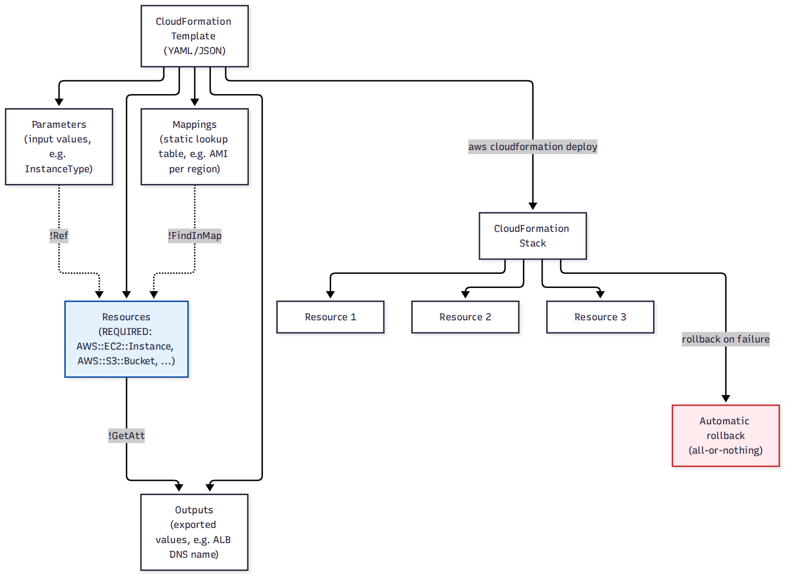
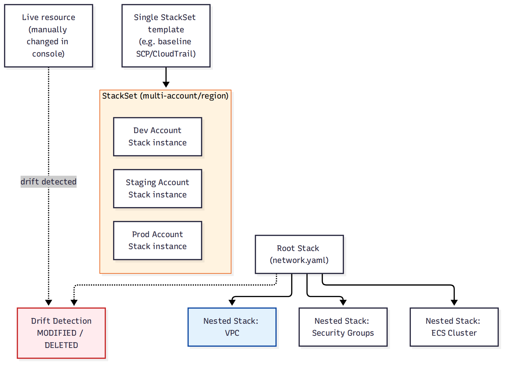
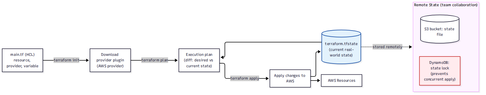

# 🗂 Module 13 Cheat Sheet — Infrastructure as Code: CloudFormation & Terraform

> **এক পাতায় পুরো module।** বিস্তারিত লাগলে Day 74–78-এ যান। এটা course-এর শেষ module।

📚 বিস্তারিত নোট: [14-Module-13-Infrastructure-as-Code](../14-Module-13-Infrastructure-as-Code/)

---

## 🖼 Visual Summary







---

## ⚡ Service at a Glance

| Concept | কী | মূল পয়েন্ট |
|---|---|---|
| **CloudFormation** | AWS-native IaC | YAML/JSON template, Stack/StackSet |
| **Nested Stack** | Template-এর মধ্যে template | Reusable component |
| **StackSet** | একসাথে অনেক account/region-এ deploy | Organization-wide IaC |
| **Terraform** | Multi-cloud IaC (HashiCorp) | HCL syntax, state file দিয়ে track |
| **Terraform State** | বর্তমান infrastructure-এর snapshot | Remote backend (S3+DynamoDB lock) ব্যবহার করুন |
| **Terraform Module** | Reusable Terraform code | Input variables + output |
| **Terraform Workspace** | একই code, ভিন্ন environment | dev/staging/prod আলাদা state |

---

## 🔀 CloudFormation vs Terraform

| | CloudFormation | Terraform |
|---|---|---|
| Provider | শুধু AWS | Multi-cloud (AWS, GCP, Azure...) |
| Syntax | YAML/JSON | HCL |
| State management | AWS নিজে রাখে | নিজে backend সেটআপ করতে হয় (S3+DynamoDB) |
| Drift detection | Built-in | `terraform plan` দিয়ে দেখা যায় |

---

## 💻 Practical Commands

```bash
# Terraform workflow
terraform init          # provider + backend initialize
terraform plan           # কী change হবে দেখা
terraform apply          # apply করা
terraform destroy        # সব infrastructure মুছে ফেলা

# Existing resource import করা (কোড না লিখেই তৈরি resource-কে state-এ আনা)
terraform import aws_s3_bucket.orders_bucket shopbd-orders-prod

# Workspace দিয়ে environment আলাদা করা
terraform workspace new dev
```

---

## ⚠️ Top Gotchas

1. **Terraform state file-এ sensitive data plaintext থাকে** — remote backend (S3, encrypted) + access control ছাড়া local-এ রাখা উচিত না।
2. **State lock ছাড়া টিমে কাজ করলে** দুইজন একসাথে apply করলে state করাপ্ট হতে পারে — DynamoDB lock টেবিল ব্যবহার করুন।
3. **CloudFormation stack delete করলে** DeletionPolicy না থাকলে RDS/S3-সহ সব resource মুছে যেতে পারে।
4. **Terraform-এ manual console change করলে drift হয়** — `terraform plan` অবশ্যই apply-এর আগে review করুন।
5. **Nested stack-এ parameter/output ভুল map করলে** পুরো stack rollback হয়ে যায় — ছোট change-ও পুরো stack আটকে দিতে পারে।

---

## 🔢 মনে রাখার সংখ্যা

- CloudFormation stack limit: **200 resources per stack** (নেস্টেড স্ট্যাক দিয়ে বাইপাস করা যায়)
- Terraform state backend: সবচেয়ে কমন হলো **S3 + DynamoDB (locking)**
- StackSet: এক জায়গা থেকে **multi-account + multi-region** deploy

---

## 🎓 পুরো Course শেষ!

এটা ছিল ১৩ নম্বর (এবং শেষ) module-এর cheat sheet — অভিনন্দন! এখন সময় [SAA-C03 Exam Prep](../98-SAA-C03-Exam-Prep/) আর [Interview Q&A](../99-Interview-QA/) দিয়ে পুরো knowledge ঝালিয়ে নেওয়ার।

**⏮ পূর্ববর্তী:** [Module 12 Cheat Sheet](./12-Module-12-Cost-Optimization-Cheat-Sheet.md) | **🏠 সব Cheat Sheet:** [README](../README.md#-cheat-sheets)
