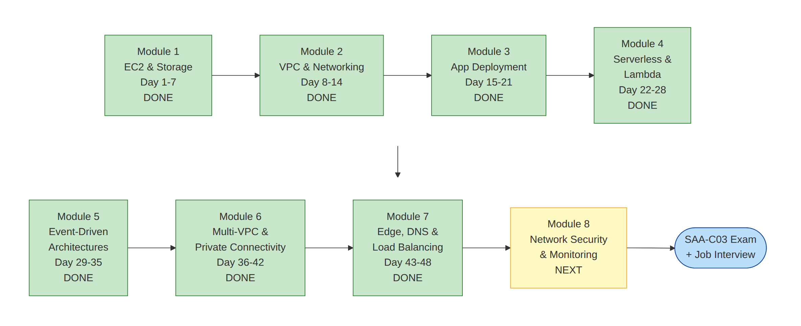

<div align="center">

# ☁️ AWS-NOTES

**বাংলায় AWS শিখুন — Beginner থেকে Solutions Architect পর্যন্ত**

Day-wise course note · Technical deep dive · Diagram · Interview Q&A · SAA-C03 exam prep


</div>

---

## 🗺 Course Roadmap



| Module | বিষয় | Status | Progress |
|---|---|---|---|
| 1 | EC2 & Storage Fundamentals | ✅ সম্পূর্ণ | `██████████` 7/7 দিন |
| 2 | VPC Design & Network Architecture | ✅ সম্পূর্ণ | `██████████` 7/7 দিন |
| 3 | Application Deployment on EC2 with systemd | ✅ সম্পূর্ণ | `██████████` 7/7 দিন |
| 4 | Serverless & Lambda Fundamentals | ✅ সম্পূর্ণ | `██████████` 7/7 দিন |
| 5 | Event-Driven Architectures with Lambda | ✅ সম্পূর্ণ | `██████████` 7/7 দিন |
| 6 | Multi-VPC & Private Connectivity | ✅ সম্পূর্ণ | `██████████` 7/7 দিন |
| 7 | Edge Services, DNS & Load Balancing | ✅ সম্পূর্ণ | `██████████` 6/6 দিন |
| 8 | Network Security & Monitoring | ✅ সম্পূর্ণ | `██████████` 5/5 দিন |
| 9 | Databases: RDS & DynamoDB (মূল ৮ module-এর বাইরে যোগ করা) | ✅ সম্পূর্ণ | `██████████` 5/5 দিন |
| 10 | Containers: ECS, EKS & Fargate (মূল ৮ module-এর বাইরে যোগ করা) | ✅ সম্পূর্ণ | `██████████` 5/5 দিন |
| 11 | CI/CD: CodePipeline & CodeBuild (মূল ৮ module-এর বাইরে যোগ করা) | ✅ সম্পূর্ণ | `██████████` 5/5 দিন |
| 12 | Cost Optimization & FinOps (মূল ৮ module-এর বাইরে যোগ করা) | ✅ সম্পূর্ণ | `██████████` 5/5 দিন |
| 13 | Infrastructure as Code: CloudFormation & Terraform (মূল ৮ module-এর বাইরে যোগ করা) | ✅ সম্পূর্ণ | `██████████` 5/5 দিন |

বিস্তারিত পাঠ্যক্রম: [Course Syllabus — ৮টি মডিউল](./00-Getting-Started/01-Course-Syllabus-8-Modules.md)

---

## 🚀 কোথা থেকে শুরু করবেন?

| আপনার লক্ষ্য | এখান থেকে শুরু করুন |
|---|---|
| 🌱 একদম নতুন, AWS কী জানি না | [Traditional IT-এর সমস্যা](./01-Fundamentals/01-Traditional-IT-Problems.md) → [Cloud Computing Deep Dive](./01-Fundamentals/02-Cloud-Computing-Deep-Dive.md) → [Day 1](./02-Module-1-EC2-and-Storage/Day-01-Cloud-Computing-AWS-Infrastructure-Account-Setup.md) |
| 🛠 Hands-on শিখতে চাই | [Module 1 — Day 1](./02-Module-1-EC2-and-Storage/Day-01-Cloud-Computing-AWS-Infrastructure-Account-Setup.md) থেকে ক্রমানুসারে |
| 🎓 SAA-C03 certification | [Exam Overview](./98-SAA-C03-Exam-Prep/01-Exam-Overview-and-Strategy.md) → [Cheat Sheet](./98-SAA-C03-Exam-Prep/02-Keyword-to-Service-Cheat-Sheet.md) → Practice প্রশ্ন |
| 💼 Job interview আসছে | [Interview প্রশ্ন](./99-Interview-QA/01-Questions.md) → [উত্তরসহ Notes](./99-Interview-QA/02-Answers-Q1-Q130.md) |
| ⚡ তাড়াতাড়ি revision | [Common Traps ও Comparisons](./98-SAA-C03-Exam-Prep/07-Common-Traps-and-Comparisons.md) |

---

## 📂 Repository Structure

```
AWS-NOTES/
├── 00-Getting-Started/                 → Syllabus ও learning roadmap
├── 01-Fundamentals/                    → Cloud, IAM, EC2, VPC — technical deep dive
├── 02-Module-1-EC2-and-Storage/        → Day 1–7
├── 03-Module-2-VPC-and-Networking/     → Day 8–14
├── 04-Module-3-Application-Deployment/ → Day 15–21
├── 05-Module-4-Serverless-and-Lambda/  → Day 22–28
├── 06-Module-5-Event-Driven-Architectures/ → Day 29–35
├── 07-Module-6-Multi-VPC-Private-Connectivity/ → Day 36–42
├── 08-Module-7-Edge-DNS-Load-Balancing/ → Day 43–48
├── 09-Module-8-Network-Security-Monitoring/ → Day 49–53
├── 10-Module-9-Databases-RDS-DynamoDB/ → Day 54–58
├── 11-Module-10-Containers-ECS-EKS-Fargate/ → Day 59–63
├── 12-Module-11-CICD-CodePipeline-CodeBuild/ → Day 64–68
├── 13-Module-12-Cost-Optimization/ → Day 69–73
├── 14-Module-13-Infrastructure-as-Code/ → Day 74–78
├── 98-SAA-C03-Exam-Prep/               → Solutions Architect Associate exam: cheat sheet + ৬২টা practice প্রশ্ন
├── 99-Interview-QA/                    → ১৩০টা interview প্রশ্ন + উত্তর
└── images/                             → Diagram (PNG) + src/ (Mermaid source)
```

---

## 🔰 00 — Getting Started

| # | Note |
|---|---|
| 1 | [Course Syllabus — ৮টি মডিউল](./00-Getting-Started/01-Course-Syllabus-8-Modules.md) |
| 2 | [Step-by-Step AWS Learning (Beginner → Job Ready)](./00-Getting-Started/02-Step-by-Step-Learning-Path.md) |
| 3 | [AWS Learning Topics Roadmap](./00-Getting-Started/03-AWS-Learning-Topics-Roadmap.md) |

## 📘 01 — Fundamentals (Deep Dive)

| # | Note |
|---|---|
| 1 | [Traditional IT Approach-এর সমস্যাগুলো](./01-Fundamentals/01-Traditional-IT-Problems.md) |
| 2 | [Cloud Computing — Technical Deep Dive](./01-Fundamentals/02-Cloud-Computing-Deep-Dive.md) |
| 3 | [AWS IAM — Technical Deep Dive](./01-Fundamentals/03-AWS-IAM-Deep-Dive.md) |
| 4 | [EC2 + VPC — Technical Deep Dive](./01-Fundamentals/04-EC2-and-VPC-Deep-Dive.md) |
| 5 | [VPC — সম্পূর্ণ Technical ব্যাখ্যা](./01-Fundamentals/05-VPC-Complete-Guide.md) |
| 6 | [AWS — DevOps-এর জন্য বিস্তারিত গাইড](./01-Fundamentals/06-AWS-for-DevOps.md) |
| 7 | [AWS Basics — Cloud, Pricing, Console, Shared Responsibility, IAM (English)](./01-Fundamentals/07-AWS-Basics-Cloud-Pricing-IAM.md) |

## 🖥 02 — Module 1: EC2 & Storage Fundamentals

| Day | Topic |
|---|---|
| 1 | [Cloud Computing, AWS Infrastructure & Account Setup](./02-Module-1-EC2-and-Storage/Day-01-Cloud-Computing-AWS-Infrastructure-Account-Setup.md) |
| 2 | [EC2 Instance Types, AMI ও EC2 Launch Process](./02-Module-1-EC2-and-Storage/Day-02-EC2-Instance-Types-AMI-Launch.md) |
| 3 | [Key Pairs, Security Groups & Elastic IP](./02-Module-1-EC2-and-Storage/Day-03-Key-Pairs-Security-Groups-Elastic-IP.md) |
| 4 | [EBS, Instance Store & EFS](./02-Module-1-EC2-and-Storage/Day-04-EBS-Instance-Store-EFS.md) |
| 5 | [S3 & Glacier](./02-Module-1-EC2-and-Storage/Day-05-S3-and-Glacier.md) |
| 6 | [EC2 Pricing Models](./02-Module-1-EC2-and-Storage/Day-06-EC2-Pricing-Models.md) |
| 7 | [Auto Scaling + Module 1 Revision](./02-Module-1-EC2-and-Storage/Day-07-Auto-Scaling-Module-1-Revision.md) |
| ➕ | [Extra: EC2 Launch, Security Group & EBS Basics (English)](./02-Module-1-EC2-and-Storage/Extra-EC2-Launch-SG-EBS-Basics.md) |

## 🌐 03 — Module 2: VPC Design & Network Architecture

| Day | Topic |
|---|---|
| 8 | [VPC Core Components & CIDR](./03-Module-2-VPC-and-Networking/Day-08-VPC-Core-Components-CIDR.md) |
| 9 | [IGW & Route Tables (Even Deeper)](./03-Module-2-VPC-and-Networking/Day-09-IGW-and-Route-Tables.md) |
| 10 | [Network ACL vs Security Group](./03-Module-2-VPC-and-Networking/Day-10-Network-ACL-vs-Security-Group.md) |
| 11 | [NAT Gateway, NAT Instance & Bastion Host](./03-Module-2-VPC-and-Networking/Day-11-NAT-Gateway-NAT-Instance-Bastion-Host.md) |
| 12 | [VPC Endpoints & PrivateLink](./03-Module-2-VPC-and-Networking/Day-12-VPC-Endpoints-PrivateLink.md) |
| 13 | [Route 53 Resolver, DHCP Options, EIP & IPv6](./03-Module-2-VPC-and-Networking/Day-13-Route53-Resolver-DHCP-EIP-IPv6.md) |
| 14 | [Network Design Patterns + Module 2 Revision](./03-Module-2-VPC-and-Networking/Day-14-Network-Design-Patterns-Module-2-Revision.md) |

## 🚀 04 — Module 3: Application Deployment on EC2 with systemd

| Day | Topic |
|---|---|
| 15 | [User Data, Cloud-init & EC2 Instance Connect](./04-Module-3-Application-Deployment/Day-15-User-Data-Cloud-init-EC2-Instance-Connect.md) |
| 16 | [SSM Session Manager & IAM Instance Profile](./04-Module-3-Application-Deployment/Day-16-SSM-Session-Manager-IAM-Instance-Profile.md) |
| 17 | [CloudWatch Agent: Memory, Disk ও Log Monitoring](./04-Module-3-Application-Deployment/Day-17-CloudWatch-Agent-Setup.md) |
| 18 | [systemd দিয়ে Service Management](./04-Module-3-Application-Deployment/Day-18-systemd-Service-Management.md) |
| 19 | [Nginx Reverse Proxy ও Node.js / Python App Deploy](./04-Module-3-Application-Deployment/Day-19-Nginx-Reverse-Proxy-App-Deploy.md) |
| 20 | [PM2, Environment Config ও Log Management](./04-Module-3-Application-Deployment/Day-20-PM2-Env-Config-Log-Management.md) |
| 21 | [CI/CD: CodeDeploy + GitHub Actions + Module 3 Revision](./04-Module-3-Application-Deployment/Day-21-CICD-CodeDeploy-GitHub-Actions-Module-3-Revision.md) |

## ⚡ 05 — Module 4: Serverless & Lambda Fundamentals

| Day | Topic |
|---|---|
| 22 | [Lambda Basics: Execution Model, Handler, Memory ও Timeout](./05-Module-4-Serverless-and-Lambda/Day-22-Lambda-Basics-Execution-Model.md) |
| 23 | [Deployment Packages, Layers, Versions ও Aliases](./05-Module-4-Serverless-and-Lambda/Day-23-Deployment-Packages-Layers-Versions-Aliases.md) |
| 24 | [Invocation Models ও API Gateway](./05-Module-4-Serverless-and-Lambda/Day-24-Invocation-Models-API-Gateway.md) |
| 25 | [Event Triggers: S3, SQS, SNS, DynamoDB Streams, EventBridge](./05-Module-4-Serverless-and-Lambda/Day-25-Event-Triggers-S3-SQS-SNS-DynamoDB-EventBridge.md) |
| 26 | [Permissions ও Security: Role, Resource Policy, VPC, Secrets](./05-Module-4-Serverless-and-Lambda/Day-26-Permissions-Security-VPC-Secrets.md) |
| 27 | [Monitoring ও Performance: Logs, X-Ray, Concurrency, Power Tuning](./05-Module-4-Serverless-and-Lambda/Day-27-Monitoring-Performance-Concurrency.md) |
| 28 | [Module 4 Revision + Mini Project: Serverless Notes API](./05-Module-4-Serverless-and-Lambda/Day-28-Module-4-Revision-Serverless-API-Project.md) |

## 🔀 06 — Module 5: Event-Driven Architectures with Lambda

| Day | Topic |
|---|---|
| 29 | [SQS গভীরে: Standard বনাম FIFO, Visibility, Long Polling ও DLQ](./06-Module-5-Event-Driven-Architectures/Day-29-SQS-Deep-Dive-Standard-FIFO-DLQ.md) |
| 30 | [SNS গভীরে ও Fan-out Pattern](./06-Module-5-Event-Driven-Architectures/Day-30-SNS-Fan-out-Pattern.md) |
| 31 | [EventBridge: Event Bus, Rules, Patterns ও Cross-account](./06-Module-5-Event-Driven-Architectures/Day-31-EventBridge-Buses-Rules-Cross-Account.md) |
| 32 | [Step Functions Basics: States, Standard বনাম Express](./06-Module-5-Event-Driven-Architectures/Day-32-Step-Functions-Basics-States-Workflows.md) |
| 33 | [Step Functions: Error Handling, Retry, Callback ও Orchestration](./06-Module-5-Event-Driven-Architectures/Day-33-Step-Functions-Error-Handling-Orchestration.md) |
| 34 | [Design Patterns: Saga, Event Sourcing, CQRS, Idempotency](./06-Module-5-Event-Driven-Architectures/Day-34-Design-Patterns-Saga-Event-Sourcing-CQRS-Idempotency.md) |
| 35 | [Module 5 Revision + Mini Project: Event-Driven Order System](./06-Module-5-Event-Driven-Architectures/Day-35-Module-5-Revision-Event-Driven-Order-System.md) |

## 🔗 07 — Module 6: Multi-VPC & Private Connectivity

| Day | Topic |
|---|---|
| 36 | [VPC Peering গভীরে ও IP Address Planning](./07-Module-6-Multi-VPC-Private-Connectivity/Day-36-VPC-Peering-Deep-Dive-IP-Planning.md) |
| 37 | [Transit Gateway: Attachments, Route Tables ও Segmentation](./07-Module-6-Multi-VPC-Private-Connectivity/Day-37-Transit-Gateway-Route-Tables-Segmentation.md) |
| 38 | [Site-to-Site VPN ও BGP Routing Basics](./07-Module-6-Multi-VPC-Private-Connectivity/Day-38-Site-to-Site-VPN-BGP-Basics.md) |
| 39 | [Direct Connect, DX Gateway ও VPN over DX](./07-Module-6-Multi-VPC-Private-Connectivity/Day-39-Direct-Connect-DX-Gateway-VPN-over-DX.md) |
| 40 | [Organizations, RAM ও Shared VPC: Multi-account Network](./07-Module-6-Multi-VPC-Private-Connectivity/Day-40-Organizations-RAM-Shared-VPC-Multi-Account.md) |
| 41 | [Centralized Endpoints, PrivateLink Services ও Hybrid DNS](./07-Module-6-Multi-VPC-Private-Connectivity/Day-41-Centralized-PrivateLink-Endpoints-Hybrid-DNS.md) |
| 42 | [Module 6 Revision + Project: Multi-account Hybrid Network Design](./07-Module-6-Multi-VPC-Private-Connectivity/Day-42-Module-6-Revision-Multi-Account-Network-Design.md) |

## 🌐 08 — Module 7: Edge Services, DNS & Load Balancing

| Day | Topic |
|---|---|
| 43 | [CloudFront Basics: Distribution, Origin, HTTPS](./08-Module-7-Edge-DNS-Load-Balancing/Day-43-CloudFront-Basics-Distributions-Origins.md) |
| 44 | [CloudFront Caching, Security ও Edge Functions](./08-Module-7-Edge-DNS-Load-Balancing/Day-44-CloudFront-Caching-Security-Edge-Functions.md) |
| 45 | [Route 53: Hosted Zones, Records ও Domain Delegation](./08-Module-7-Edge-DNS-Load-Balancing/Day-45-Route53-Hosted-Zones-Records.md) |
| 46 | [Route 53 Routing Policies, Health Checks ও DNS Failover](./08-Module-7-Edge-DNS-Load-Balancing/Day-46-Route53-Routing-Policies-Health-Checks-Failover.md) |
| 47 | [Load Balancers গভীরে: ALB, NLB, GWLB](./08-Module-7-Edge-DNS-Load-Balancing/Day-47-Load-Balancers-ALB-NLB-GWLB-Deep-Dive.md) |
| 48 | [Global Accelerator + Module 7 Revision: Global Traffic Architecture Project](./08-Module-7-Edge-DNS-Load-Balancing/Day-48-Global-Accelerator-Module-7-Revision.md) |

## 🛡 09 — Module 8: Network Security & Monitoring

| Day | Topic |
|---|---|
| 49 | [Firewalls গভীরে: WAF, Shield ও Network Firewall](./09-Module-8-Network-Security-Monitoring/Day-49-WAF-Shield-Network-Firewall-Deep-Dive.md) |
| 50 | [Network Monitoring: VPC Flow Logs, Traffic Mirroring, Config ও GuardDuty](./09-Module-8-Network-Security-Monitoring/Day-50-VPC-Flow-Logs-Traffic-Mirroring-GuardDuty.md) |
| 51 | [Security Services: Security Hub, Inspector, Access Analyzer, Macie ও Detective](./09-Module-8-Network-Security-Monitoring/Day-51-Security-Hub-Inspector-Access-Analyzer-Macie-Detective.md) |
| 52 | [Compliance ও Audit: CloudTrail, Config Rules, SCP, Encryption ও Secrets Rotation](./09-Module-8-Network-Security-Monitoring/Day-52-Compliance-Audit-CloudTrail-Config-Encryption-Secrets.md) |
| 53 | [Module 8 Revision + Final Project: Complete Secure Network Architecture](./09-Module-8-Network-Security-Monitoring/Day-53-Module-8-Revision-Complete-Secure-Architecture-Project.md) |

## 🗄 10 — Module 9: Databases (RDS & DynamoDB)

> মূল ৮-module syllabus-এর বাইরে যোগ করা — relational (RDS/Aurora) ও NoSQL (DynamoDB) ডেটাবেস গভীরে।

| Day | Topic |
|---|---|
| 54 | [RDS Fundamentals: Engines, Multi-AZ ও Read Replicas](./10-Module-9-Databases-RDS-DynamoDB/Day-54-RDS-Fundamentals-Multi-AZ-Read-Replicas.md) |
| 55 | [Aurora, RDS Proxy ও Advanced Backup Strategies](./10-Module-9-Databases-RDS-DynamoDB/Day-55-Aurora-RDS-Proxy-Advanced-Backup.md) |
| 56 | [DynamoDB Fundamentals: Partition Key, Capacity Mode ও Index](./10-Module-9-Databases-RDS-DynamoDB/Day-56-DynamoDB-Fundamentals-Partition-Key-Capacity-Modes.md) |
| 57 | [DynamoDB Streams, Global Tables, DAX ও Transactions](./10-Module-9-Databases-RDS-DynamoDB/Day-57-DynamoDB-Streams-Global-Tables-DAX-Transactions.md) |
| 58 | [Module 9 Revision + Project: Polyglot Persistence Architecture](./10-Module-9-Databases-RDS-DynamoDB/Day-58-Module-9-Revision-Polyglot-Persistence-Project.md) |

## 📦 11 — Module 10: Containers (ECS, EKS & Fargate)

> মূল ৮-module syllabus-এর বাইরে যোগ করা — container orchestration গভীরে।

| Day | Topic |
|---|---|
| 59 | [Docker ও Container Fundamentals, Amazon ECR](./11-Module-10-Containers-ECS-EKS-Fargate/Day-59-Docker-Container-Fundamentals-ECR.md) |
| 60 | [Amazon ECS: Cluster, Task Definition ও Service](./11-Module-10-Containers-ECS-EKS-Fargate/Day-60-ECS-Cluster-Task-Definition-Service.md) |
| 61 | [Amazon EKS ও ECS বনাম EKS বনাম Fargate](./11-Module-10-Containers-ECS-EKS-Fargate/Day-61-EKS-Fundamentals-ECS-vs-EKS-vs-Fargate.md) |
| 62 | [Container Networking, Service Discovery ও Auto Scaling](./11-Module-10-Containers-ECS-EKS-Fargate/Day-62-Container-Networking-Service-Discovery-Auto-Scaling.md) |
| 63 | [Module 10 Revision + Project: Containerized Microservices Platform](./11-Module-10-Containers-ECS-EKS-Fargate/Day-63-Module-10-Revision-Containerized-Microservices-Project.md) |

## 🔄 12 — Module 11: CI/CD (CodePipeline & CodeBuild)

> মূল ৮-module syllabus-এর বাইরে যোগ করা — AWS-নেটিভ CI/CD orchestration গভীরে।

| Day | Topic |
|---|---|
| 64 | [AWS CodeBuild Fundamentals: Buildspec ও Build Phases](./12-Module-11-CICD-CodePipeline-CodeBuild/Day-64-CodeBuild-Fundamentals-Buildspec-Phases.md) |
| 65 | [AWS CodePipeline: Stage, Action ও Artifact](./12-Module-11-CICD-CodePipeline-CodeBuild/Day-65-CodePipeline-Fundamentals-Stages-Actions.md) |
| 66 | [Full CI/CD Pipeline to ECS: Blue/Green Deploy](./12-Module-11-CICD-CodePipeline-CodeBuild/Day-66-CodePipeline-ECS-BlueGreen-Deploy.md) |
| 67 | [Pipeline Security ও Advanced Patterns](./12-Module-11-CICD-CodePipeline-CodeBuild/Day-67-Pipeline-Security-Advanced-Patterns.md) |
| 68 | [Module 11 Revision + Project: End-to-End CI/CD Pipeline](./12-Module-11-CICD-CodePipeline-CodeBuild/Day-68-Module-11-Revision-End-to-End-CICD-Project.md) |

## 💰 13 — Module 12: Cost Optimization & FinOps

> মূল ৮-module syllabus-এর বাইরে যোগ করা — cost visibility, control ও optimization গভীরে।

| Day | Topic |
|---|---|
| 69 | [Cost Visibility: Cost Explorer, Cost & Usage Report ও Tags](./13-Module-12-Cost-Optimization/Day-69-Cost-Visibility-Cost-Explorer-CUR-Tags.md) |
| 70 | [AWS Budgets, Alerts ও Cost Anomaly Detection](./13-Module-12-Cost-Optimization/Day-70-Budgets-Alerts-Anomaly-Detection.md) |
| 71 | [Savings Plans, Reserved Instances ও Spot: EC2-এর বাইরেও](./13-Module-12-Cost-Optimization/Day-71-Savings-Plans-Reserved-Instances-Beyond-EC2.md) |
| 72 | [Trusted Advisor, Compute Optimizer ও Rightsizing](./13-Module-12-Cost-Optimization/Day-72-Trusted-Advisor-Compute-Optimizer-Rightsizing.md) |
| 73 | [Module 12 Revision + Project: FinOps Cost Optimization Plan](./13-Module-12-Cost-Optimization/Day-73-Module-12-Revision-FinOps-Cost-Optimization-Project.md) |

## 🏗 14 — Module 13: Infrastructure as Code (CloudFormation & Terraform)

> মূল ৮-module syllabus-এর বাইরে যোগ করা — শেষ module, IaC গভীরে।

| Day | Topic |
|---|---|
| 74 | [CloudFormation Fundamentals: Template Anatomy](./14-Module-13-Infrastructure-as-Code/Day-74-CloudFormation-Fundamentals-Template-Anatomy.md) |
| 75 | [CloudFormation Advanced: Nested Stacks, StackSets ও Drift Detection](./14-Module-13-Infrastructure-as-Code/Day-75-CloudFormation-Advanced-Nested-Stacks-StackSets-Drift.md) |
| 76 | [Terraform Fundamentals: HCL, Provider ও State](./14-Module-13-Infrastructure-as-Code/Day-76-Terraform-Fundamentals-HCL-Provider-State.md) |
| 77 | [Terraform Modules, Workspaces ও CloudFormation বনাম Terraform](./14-Module-13-Infrastructure-as-Code/Day-77-Terraform-Modules-Workspaces-CloudFormation-vs-Terraform.md) |
| 78 | [Module 13 Revision + Project: IaC-ify করা ShopBD Platform](./14-Module-13-Infrastructure-as-Code/Day-78-Module-13-Revision-IaC-ShopBD-Platform-Project.md) |

## 🎓 98 — AWS Solutions Architect Associate (SAA-C03) Exam Prep

| # | Note |
|---|---|
| 1 | [Exam Overview ও Strategy](./98-SAA-C03-Exam-Prep/01-Exam-Overview-and-Strategy.md) |
| 2 | [Keyword → Service Cheat Sheet](./98-SAA-C03-Exam-Prep/02-Keyword-to-Service-Cheat-Sheet.md) |
| 3 | [Domain 1: Secure Architectures — ১৬টা প্রশ্ন](./98-SAA-C03-Exam-Prep/03-Domain-1-Secure-Architectures.md) |
| 4 | [Domain 2: Resilient Architectures — ১৫টা প্রশ্ন](./98-SAA-C03-Exam-Prep/04-Domain-2-Resilient-Architectures.md) |
| 5 | [Domain 3: High-Performing Architectures — ১৬টা প্রশ্ন](./98-SAA-C03-Exam-Prep/05-Domain-3-High-Performing-Architectures.md) |
| 6 | [Domain 4: Cost-Optimized Architectures — ১৫টা প্রশ্ন](./98-SAA-C03-Exam-Prep/06-Domain-4-Cost-Optimized-Architectures.md) |
| 7 | [Common Traps ও Comparisons](./98-SAA-C03-Exam-Prep/07-Common-Traps-and-Comparisons.md) |

## 🎯 99 — Interview Q&A

| # | Note |
|---|---|
| 1 | [AWS Interview Questions (Q1–Q130)](./99-Interview-QA/01-Questions.md) |
| 2 | [উত্তরসহ Notes (Q1–Q130)](./99-Interview-QA/02-Answers-Q1-Q130.md) |

---

## 🧭 কীভাবে পড়বেন

1. **00-Getting-Started** — Syllabus দেখে পুরো roadmap বুঝে নিন।
2. **01-Fundamentals** — Cloud, IAM, EC2, VPC-এর মূল ধারণা।
3. **02 → 14 Modules** — Day-wise hands-on note ক্রমানুসারে।
4. **98-SAA-C03-Exam-Prep**: certification দিতে চাইলে cheat sheet পড়ে practice প্রশ্নগুলো নিজে solve করুন।
5. **99-Interview-QA** — প্রতিটা module শেষে সংশ্লিষ্ট প্রশ্নগুলো নিজে উত্তর দিয়ে practice করুন, তারপর answer মিলিয়ে দেখুন।

### ✍️ নতুন note যোগ করার নিয়ম
- নতুন Day note → সংশ্লিষ্ট module folder-এ `Day-XX-Topic-Name.md` নামে রাখুন (যেমন `Day-17-CloudWatch-Agent-Setup.md`)।
- নতুন module শুরু হলে → `09-Module-8-Network-Security-Monitoring/` এর মতো নতুন folder খুলুন।
- এই README-র টেবিলে link যোগ করুন।
- নতুন diagram → `images/src/`-এ `.mmd` (Mermaid) file লিখে PNG render করুন:
  `npx -p @mermaid-js/mermaid-cli mmdc -i images/src/xx.mmd -o images/xx.png -b white -s 2`

---

## 🤝 Contribute / ভুল পেলে

- কোনো তথ্য ভুল বা পুরনো মনে হলে **Issue** খুলুন, অথবা সরাসরি **Pull Request** দিন।
- AWS-এর service, দাম আর limit প্রায়ই বদলায়, তাই গুরুত্বপূর্ণ সিদ্ধান্তের আগে [AWS Documentation](https://docs.aws.amazon.com/) মিলিয়ে নিন।

<div align="center">

⭐ এই note কাজে লাগলে repo-তে একটা **Star** দিন, যাতে অন্যরাও খুঁজে পায়।

</div>
